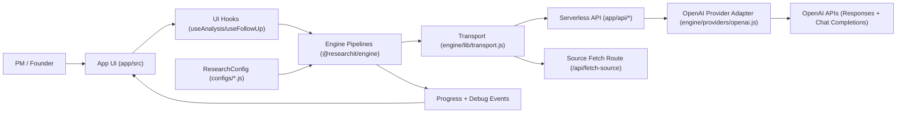

# ResearchIt

ResearchIt is a config-driven AI research engine plus a product shell.

The core idea is simple: most AI tools generate fluent reports, but strategic decisions need auditable structure. ResearchIt turns a question into:
- weighted per-dimension scores,
- evidence and confidence per dimension,
- explicit analyst-vs-critic disagreement,
- follow-up challenge threads,
- exportable, reproducible artifacts.

## Idea

ResearchIt is built for decisions like:
- Should we build this AI product?
- Should we buy vs build?
- Which opportunity should we prioritize first?
- Which variant is stronger after pressure-testing assumptions?

The product is intentionally opinionated about process, not outcomes:
- Evidence first, then scoring.
- Critique is required, not optional.
- Score changes are explicit and reviewable.
- Configuration is first-class so the same engine can power different research types.

## Repository Architecture

This repo is a monorepo with three top-level concerns.

```txt
researchit/
  app/                                # Deployable product shell (React + Vite + Vercel API routes)
  engine/                             # Reusable research engine package (@researchit/engine)
  configs/                            # ResearchConfig instances used by products
```

### app/
`app/` owns user experience and deployment concerns:
- React UI and tabs (`app/src/components/*`)
- client state wiring (`app/src/App.jsx`)
- exports and browser-side helpers (`app/src/lib/*`)
- serverless endpoints (`app/api/*`)

It consumes the engine package via `"@researchit/engine": "file:../engine"`.

### engine/
`engine/` owns research behavior and core contracts:
- pipelines (`engine/pipeline/analysis.js`, `engine/pipeline/followUp.js`)
- provider adapter (`engine/providers/openai.js`)
- transport abstraction (`engine/lib/transport.js`)
- scoring, rubric, confidence, serialization, debug primitives (`engine/lib/*`)
- default dimensions and prompts (`engine/configs/*`, `engine/prompts/*`)

Engine design constraints:
- no React dependency
- no browser-only APIs in core logic
- dependency-injected transport for LLM/source calls

### configs/
`configs/` contains concrete `ResearchConfig` objects (for this product: `configs/research-configurations.js`).

### Architecture Diagram



## Analysis Pipeline

Current pipeline (quality-first):
1. Analyst baseline pass (memory-only)
2. Analyst web pass (live-search assisted)
3. Reconcile pass (merge evidence, re-score)
4. Targeted low-confidence cycle (query plan -> web harvest -> re-score)
5. Critic audit pass
6. Analyst final response pass
7. Consistency check pass
8. Discovery generation + candidate pre-validation

Follow-up pipeline classifies PM intent (`challenge`, `question`, `reframe`, `add_evidence`, `note`, `re_search`) and executes intent-specific logic with explicit score proposals.

## Plan Alignment Status

Status against `ResearchIt—Engine-Extraction-Restructuring-Plan.md`: **partially complete**.

Implemented:
- Engine extracted to `engine/` with independent package boundary and barrel exports.
- Pipelines live in `engine/pipeline/*` and run through injected transport (`engine/lib/transport.js`).
- OpenAI provider logic centralized in `engine/providers/openai.js`.
- Product shell runs from `app/` and consumes engine via `@researchit/engine`.
- Config-driven tabs are implemented via `configs/research-configurations.js`.

Remaining to fully match plan intent:
1. Remove product-specific framing from engine pipeline prompts.
Current `engine/pipeline/analysis.js` still hardcodes outsourcing-delivery phrasing in several prompt builders. This should move to defaults/config-driven prompt text only.
2. Optional cleanup of compatibility shims in `app/src/lib/*`, `app/src/constants/*`, and `app/src/prompts/*`.
These files are mostly thin re-exports for backward compatibility; the target structure expects a smaller app-lib surface.
3. Archive or replace `ResearchIt—Engine-Extraction-Restructuring-Plan.md`.
It is now historical and still references old names/paths from the migration phase.

## Configuration

Research behavior is configured through a `ResearchConfig` object.

Primary config in this repo:
- `configs/research-configurations.js`

Default single-config alias:
- `configs/researchit-prioritizer.js`

Engine-level default dimensions preset (legacy compatibility export) lives in:
- `engine/configs/researchit-dimensions.js`

Default system prompts live in:
- `engine/prompts/defaults.js`

### ResearchConfig shape

```js
{
  id: "startup-product-idea-validation",
  name: "Startup / Product Idea Validation",
  tabLabel: "Startup Validation", // UI label for tabbed config selection
  engineVersion: "1.0.0",

  dimensions: [
    {
      id: "problem-severity",
      label: "Problem Severity",
      weight: 22,
      enabled: true,
      brief: "...",
      fullDef: "..."
    }
  ],

  relatedDiscovery: true,

  prompts: {
    analyst: "...",
    critic: "...",
    analystResponse: "...",
    followUp: "..."
  },

  models: {
    analyst: {
      provider: "openai",
      model: "gpt-5.4-mini",
      webSearchModel: "gpt-5.4-mini",   // optional; defaults to model
      baseUrl: "https://api.openai.com"  // optional
    },
    critic: {
      provider: "openai",
      model: "gpt-5.4",
      webSearchModel: "gpt-5.4",        // optional
      baseUrl: "https://api.openai.com" // optional
    }
  },

  limits: {
    maxSourcesPerDim: 14,
    discoveryMaxCandidates: 5,
    tokenLimits: {
      phase1Evidence: 10000,
      phase1Scoring: 12000,
      critic: 6000,
      phase3Response: 6000,
      followUpQuestion: 1400,
      followUpChallenge: 2100,
      intentClassification: 450
    }
  }
}
```

## Local Development

### Prerequisites
- Node.js 20+
- npm
- Vercel CLI (optional but recommended for local serverless parity)

### Environment
Create:
- `app/.env.local`

Minimum server-side variable:
```bash
OPENAI_API_KEY=sk-...
```

Optional provider/model/key overrides (env-first):
```bash
RESEARCHIT_PROVIDER=openai                  # or openai_compatible
RESEARCHIT_API_KEY=...                      # global provider key override
RESEARCHIT_BASE_URL=https://api.openai.com # or your OpenAI-compatible endpoint

RESEARCHIT_ANALYST_PROVIDER=openai
RESEARCHIT_ANALYST_API_KEY=...
RESEARCHIT_ANALYST_MODEL=gpt-5.4-mini
RESEARCHIT_ANALYST_WEBSEARCH_MODEL=gpt-5.4-mini
RESEARCHIT_ANALYST_BASE_URL=https://api.openai.com

RESEARCHIT_CRITIC_PROVIDER=openai
RESEARCHIT_CRITIC_API_KEY=...
RESEARCHIT_CRITIC_MODEL=gpt-5.4
RESEARCHIT_CRITIC_WEBSEARCH_MODEL=gpt-5.4
RESEARCHIT_CRITIC_BASE_URL=https://api.openai.com
```

OpenAI-prefixed aliases are also supported for compatibility:
```bash
OPENAI_BASE_URL=https://api.openai.com
OPENAI_MODEL=gpt-5.4
OPENAI_WEBSEARCH_MODEL=gpt-5.4
OPENAI_ANALYST_MODEL=gpt-5.4-mini
OPENAI_ANALYST_WEBSEARCH_MODEL=gpt-5.4-mini
OPENAI_CRITIC_MODEL=gpt-5.4
OPENAI_CRITIC_WEBSEARCH_MODEL=gpt-5.4
```

Resolution precedence for provider/model/base URL is:
1. Role-specific `RESEARCHIT_*` env vars
2. Global `RESEARCHIT_*` env vars
3. OpenAI-prefixed env aliases
4. `ResearchConfig.models.*` values
5. Built-in defaults

Key handling:
- Current app architecture is server-key only.
- API key is read from env vars (`RESEARCHIT_*_API_KEY`, `RESEARCHIT_API_KEY`, `OPENAI_API_KEY`).
- Request-body API keys are intentionally not used yet.
- End-user BYOK UI will be added later without changing engine contracts.

### Install
From repo root:
```bash
cd app
npm install
```

### Run
Using Vercel dev runtime:
```bash
cd app
npx vercel dev
```

Open:
- `http://localhost:3000`

### Build
From repo root:
```bash
npm run build
```

(or `cd app && npm run build`)

## Deployment (Vercel)

This repo deploys from root with root-level `vercel.json` that builds `app/`:
- install command: `cd app && npm install`
- build command: `cd app && npm run build`
- output directory: `app/dist`

Root-level API entrypoints (`/api/analyst`, `/api/critic`, `/api/fetch-source`) re-export handlers from `app/api/*`.

If deployment settings in Vercel override these commands, reset them so repo `vercel.json` takes effect.

## Contribution Flow

### 1) Pick scope
Open an issue (or use an existing one) describing:
- problem statement
- expected behavior
- affected area (`engine`, `app`, or `config`)

### 2) Branch
Create a branch from `main`.
Use small focused changes. Avoid mixing refactor + feature + style-only edits in one PR.

### 3) Implement
Recommended boundaries:
- Engine logic changes in `engine/*`
- Product/UI changes in `app/*`
- Domain behavior changes in `configs/*`

### 4) Validate locally
Minimum checks before PR:
```bash
cd app
npm run build
```

If touching runtime behavior, run at least one end-to-end analysis and one follow-up flow in local dev.

### 5) Submit PR
Include:
- what changed
- why it changed
- risk/regression notes
- screenshots/GIFs for UI changes
- migration notes if config/contracts changed

## Security Notes

- Never commit real API keys.
- Keep `.env.local` local only.
- If a key was exposed, rotate immediately.

## License

No license file is currently defined in this repository.
Add one before publishing broader external contributions.
