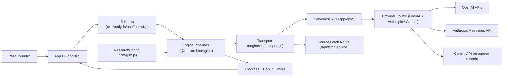

# ResearchIt

ResearchIt is a config-driven AI research engine plus a product shell.

The core idea is simple: most AI tools generate fluent reports, but strategic decisions need auditable structure. ResearchIt turns a question into:
- weighted per-dimension scores,
- evidence and confidence per dimension,
- explicit analyst-vs-critic disagreement,
- follow-up challenge threads,
- exportable, reproducible artifacts.

## Idea

ResearchIt is built for decisions like:
- Should we build this AI product?
- Should we buy vs build?
- Which opportunity should we prioritize first?
- Which variant is stronger after pressure-testing assumptions?

The product is intentionally opinionated about process, not outcomes:
- Evidence first, then scoring.
- Critique is required, not optional.
- Score changes are explicit and reviewable.
- Configuration is first-class so the same engine can power different research types.

## Repository Architecture

This repo is a monorepo with three top-level concerns.

```txt
researchit/
  app/                                # Deployable product shell (React + Vite + Vercel API routes)
  engine/                             # Reusable research engine package (@researchit/engine)
  configs/                            # ResearchConfig instances used by products
```

### app/
`app/` owns user experience and deployment concerns:
- React UI and tabs (`app/src/components/*`)
- client state wiring (`app/src/App.jsx`)
- exports and browser-side helpers (`app/src/lib/*`)
- serverless endpoints (`app/api/*`)

It consumes the engine package via `"@researchit/engine": "file:../engine"`.

### engine/
`engine/` owns research behavior and core contracts:
- pipelines (`engine/pipeline/analysis.js`, `engine/pipeline/followUp.js`)
- base OpenAI adapter (`engine/providers/openai.js`)
- transport abstraction (`engine/lib/transport.js`)
- scoring, rubric, confidence, serialization, debug primitives (`engine/lib/*`)
- default dimensions and prompts (`engine/configs/*`, `engine/prompts/*`)

Engine design constraints:
- no React dependency
- no browser-only APIs in core logic
- dependency-injected transport for LLM/source calls

### configs/
`configs/` contains concrete `ResearchConfig` objects (for this product: `configs/research-configurations.js`).

### Architecture Diagram



## Analysis Pipeline

Scorecard pipeline (quality-first):
1. Analyst baseline pass (memory-only)
2. Analyst web pass (live-search assisted)
3. Reconcile pass (merge evidence, re-score, apply quality guard retry/fail-fast if merge looks implausible)
4. Targeted low-confidence cycle (query plan -> web harvest -> re-score)
5. Critic audit pass
6. Analyst final response pass
7. Consistency check pass + decision/confidence/polarity post-guards
8. Discovery generation + candidate pre-validation

Matrix pipeline:
1. Plan + input resolution (decision question, subject set)
2. Baseline matrix pass (memory-only)
3. Web matrix pass
4. Reconcile baseline + web drafts (with quality guard retry/fail-fast)
5. Targeted low-confidence cell recovery
6. Critic matrix audit
7. Analyst response (defend or concede contested cells)
8. Matrix summary (+ optional matrix discovery suggestions)

Source verification runs after source-producing phases in both scorecard and matrix flows. Cited URLs are checked with `fetchSource`; unverified claims can reduce confidence.
Run diagnostics are captured in `analysisMeta` and surfaced in Progress UI + exports (HTML/PDF/Markdown).

Follow-up pipeline classifies PM intent (`challenge`, `question`, `reframe`, `add_evidence`, `note`, `re_search`) and executes intent-specific logic with explicit score proposals. Matrix follow-ups are supported at cell level (`subjectId` × `attributeId`) in addition to scorecard dimension threads.

## Architecture Reference

`docs/architecture.md` is the authoritative architecture contract for:
- module boundaries (`engine`, `app`, `configs`)
- data flow and pipeline phases
- `ResearchConfig` contract
- invariants that must stay true during future changes

Read it before refactors or cross-module changes:
- [docs/architecture.md](docs/architecture.md)

## Configuration

Research behavior is configured through a `ResearchConfig` object.

Primary config in this repo:
- `configs/research-configurations.js`

Default single-config alias:
- `configs/researchit-prioritizer.js`

Engine-level default dimensions preset (legacy compatibility export) lives in:
- `engine/configs/researchit-dimensions.js`

Default system prompts live in:
- `engine/prompts/defaults.js`

### ResearchConfig shape

```js
{
  id: "startup-product-idea-validation",
  name: "Startup / Product Idea Validation",
  tabLabel: "Startup Validation", // UI label for tabbed config selection
  outputMode: "scorecard", // "scorecard" | "matrix"
  shortDescription: "Short card copy used on homepage and discovery surfaces",
  methodology: "Methodological foundation shown in UI (supports inline markdown links)",
  engineVersion: "1.0.0",

  inputSpec: {
    label: "New Research - describe the startup or product idea",
    placeholder: "E.g. AI co-pilot for insurance claims adjusters in US mid-market carriers.",
    description: "What this research type expects as input. Broad input is allowed."
  },

  framingFields: [
    {
      id: "researchObject",
      label: "Research Object",
      description: "What is being evaluated"
    },
    {
      id: "decisionQuestion",
      label: "Decision Question",
      description: "What decision the research should inform"
    },
    {
      id: "scopeContext",
      label: "Scope / Context",
      description: "Explicit segment, geography, timeframe, constraints (or unspecified)"
    }
  ],

  // scorecard mode
  dimensions: [
    {
      id: "problem-severity",
      label: "Problem Severity",
      weight: 22,
      enabled: true,
      brief: "...",
      fullDef: "...",
      polarityHint: "Higher score means stronger decision attractiveness",
      researchHints: {
        whereToLook: ["industry reports", "earnings calls", "regulatory filings"],
        queryTemplates: ["<segment> pain evidence", "<product> adoption benchmark"]
      }
    }
  ],

  // matrix mode
  matrixLayout: "auto", // "subjects-as-rows" | "subjects-as-columns" | "auto" (UI default hint)
  subjects: {
    label: "Competitors",
    inputPrompt: "List the competitors to analyze (optional override; auto-discovery supported)",
    examples: ["Notion", "Coda", "Confluence"],
    minCount: 2,
    maxCount: 8
  },
  attributes: [
    {
      id: "pricing-model",
      label: "Pricing Model",
      brief: "Pricing structure and tiering",
      derived: false // optional
    }
  ],

  relatedDiscovery: true,

  prompts: {
    analyst: "...",
    critic: "...",
    analystResponse: "...",
    followUp: "..."
  },

  models: {
    analyst: {
      provider: "openai",
      model: "gpt-5.4-mini",
      webSearchModel: "gpt-5.4-mini",   // optional; defaults to model
      baseUrl: "https://api.openai.com"  // optional
    },
    critic: {
      provider: "anthropic",
      model: "claude-sonnet-4-20250514",
      webSearchModel: "claude-sonnet-4-20250514", // optional
      baseUrl: "https://api.anthropic.com" // optional
    },
    retrieval: {
      provider: "gemini",
      model: "gemini-2.5-flash",
      webSearchModel: "gemini-2.5-flash"
    }
  },

  limits: {
    maxSourcesPerDim: 14,
    discoveryMaxCandidates: 5,
    matrixCoverageSLA: {
      minSourcesPerCell: 2,
      minSubjectEvidenceCoverage: 0.5,
      maxUnresolvedCellsRatio: 0.35
    },
    criticFlagMonitoring: {
      minAuditedCells: 8,
      minFlagRate: 0.1,
      highLowConfidenceRate: 0.3
    },
    tokenLimits: {
      phase1Evidence: 10000,
      phase1Scoring: 12000,
      critic: 6000,
      phase3Response: 6000,
      followUpQuestion: 1400,
      followUpChallenge: 2100,
      intentClassification: 450
    }
  }
}
```

For matrix configs, a single free-form prompt is accepted. The engine can extract subjects from the prompt and, when needed, run subject discovery before analysis.

In scorecard mode, analysis `attributes` also include an `inputFrame` block used by UI:

```js
{
  inputFrame: {
    providedInput: "<verbatim user input>",
    framingFields: {
      researchObject: "<value or 'unspecified'>",
      decisionQuestion: "<value or 'unspecified'>",
      scopeContext: "<value or 'unspecified'>"
    },
    assumptionsUsed: [],
    confidenceLimits: "<what cannot be concluded from current input/evidence>"
  }
}
```

## Local Development

### Prerequisites
- Node.js 20+
- npm
- Vercel CLI (optional but recommended for local serverless parity)

### Environment
Create:
- `app/.env.local`

Minimum server-side variable:
```bash
OPENAI_API_KEY=sk-...
```

Optional provider/model/key overrides (env-first):
```bash
RESEARCHIT_PROVIDER=openai                  # or anthropic / gemini / openai_compatible
RESEARCHIT_API_KEY=...                      # global provider key override
RESEARCHIT_BASE_URL=https://api.openai.com # or your OpenAI-compatible endpoint

RESEARCHIT_ANALYST_PROVIDER=openai
RESEARCHIT_ANALYST_API_KEY=...
RESEARCHIT_ANALYST_MODEL=gpt-5.4-mini
RESEARCHIT_ANALYST_WEBSEARCH_MODEL=gpt-5.4-mini
RESEARCHIT_ANALYST_BASE_URL=https://api.openai.com

RESEARCHIT_CRITIC_PROVIDER=anthropic
RESEARCHIT_CRITIC_API_KEY=...
RESEARCHIT_CRITIC_MODEL=claude-sonnet-4-20250514
RESEARCHIT_CRITIC_WEBSEARCH_MODEL=claude-sonnet-4-20250514
RESEARCHIT_CRITIC_BASE_URL=https://api.anthropic.com

# Provider-specific keys (recommended for quality-first routing)
ANTHROPIC_API_KEY=...
GEMINI_API_KEY=...
```

OpenAI-prefixed aliases are also supported for compatibility:
```bash
OPENAI_BASE_URL=https://api.openai.com
OPENAI_MODEL=gpt-5.4
OPENAI_WEBSEARCH_MODEL=gpt-5.4
OPENAI_ANALYST_MODEL=gpt-5.4-mini
OPENAI_ANALYST_WEBSEARCH_MODEL=gpt-5.4-mini
OPENAI_CRITIC_MODEL=gpt-5.4
OPENAI_CRITIC_WEBSEARCH_MODEL=gpt-5.4
```

Optional SEO canonical base URL (used by build-time prerendering):
```bash
RESEARCHIT_PUBLIC_URL=https://your-domain.example
```
For production auth/account routes, this same variable is required (used as trusted magic-link origin).

Phase 1 account/auth variables:
```bash
# Session signing (required for production auth/account routes)
RESEARCHIT_AUTH_SECRET=replace-with-long-random-secret

# Magic-link email delivery (if not set, dev link fallback is used)
RESEND_API_KEY=re_...
RESEARCHIT_AUTH_FROM_EMAIL=Research it <noreply@your-domain.example>

# Optional: allow dev link fallback in production (default false in production)
RESEARCHIT_AUTH_ALLOW_DEV_LINK=false

# Public base URL used for magic-link origin (required for production auth/account routes)
RESEARCHIT_PUBLIC_URL=https://your-domain.example

# Persistent account storage via Upstash/Vercel KV REST API
# required for production auth/account routes
KV_REST_API_URL=https://...upstash.io
KV_REST_API_TOKEN=...
# aliases are also supported:
UPSTASH_REDIS_REST_URL=https://...upstash.io
UPSTASH_REDIS_REST_TOKEN=...
```

Without KV env vars, account data falls back to in-memory storage in local/dev only; production auth/account APIs fail closed until KV is configured.

Default routing behavior:
- Native scorecard/matrix:
  - Analyst synthesis/scoring -> OpenAI (default model)
  - Retrieval/live-search-heavy phases -> Gemini (with grounded search where available), fallback mesh enabled
  - Critic -> Anthropic (default model), fallback mesh enabled
- Deep Assist:
  - ChatGPT lane -> OpenAI
  - Claude lane -> Anthropic
  - Gemini lane -> Gemini
  - Provider outputs are merged, then shared critic/verification/scoring layers run.

Resolution precedence for provider/model/base URL is:
1. Role-specific `RESEARCHIT_*` env vars
2. Global `RESEARCHIT_*` env vars
3. OpenAI-prefixed env aliases
4. `ResearchConfig.models.*` values
5. Built-in defaults

Key handling:
- Current app architecture is server-key only.
- API key is read from env vars with provider-aware resolution:
  - provider-specific first (`RESEARCHIT_<ROLE>_<PROVIDER>_API_KEY`, `RESEARCHIT_<PROVIDER>_API_KEY`, etc.)
  - then role/global `RESEARCHIT_*_API_KEY`
  - `OPENAI_*` / `OPENAI_API_KEY` are used for OpenAI provider resolution only
- Request-body API keys are intentionally not used yet.
- End-user BYOK UI will be added later without changing engine contracts.

### Install
From repo root:
```bash
cd app
npm install
```

### Run
Using Vercel dev runtime:
```bash
cd app
npx vercel dev
```

Open:
- `http://localhost:3000`

### Build
From repo root:
```bash
npm run build
```

(or `cd app && npm run build`)

## Deployment (Vercel)

This repo deploys from root with root-level `vercel.json` that builds `app/`:
- install command: `cd app && npm install`
- build command: `cd app && npm run build`
- output directory: `app/dist`

Root-level API entrypoints re-export handlers from `app/api/*`:
- research pipeline: `/api/analyst`, `/api/critic`, `/api/fetch-source`
- auth/session: `/api/auth/request-link`, `/api/auth/verify`, `/api/auth/session`, `/api/auth/logout`
- account data: `/api/account/researches`

If deployment settings in Vercel override these commands, reset them so repo `vercel.json` takes effect.

## Contribution Flow

### 1) Pick scope
Open an issue (or use an existing one) describing:
- problem statement
- expected behavior
- affected area (`engine`, `app`, or `config`)

### 2) Branch
Create a branch from `main`.
Use small focused changes. Avoid mixing refactor + feature + style-only edits in one PR.

### 3) Implement
Recommended boundaries:
- Engine logic changes in `engine/*`
- Product/UI changes in `app/*`
- Domain behavior changes in `configs/*`

### 4) Validate locally
Minimum checks before PR:
```bash
cd app
npm run build
```

If touching runtime behavior, run at least one end-to-end analysis and one follow-up flow in local dev.

### 5) Submit PR
Include:
- what changed
- why it changed
- risk/regression notes
- screenshots/GIFs for UI changes
- migration notes if config/contracts changed

## Security Notes

- Never commit real API keys.
- Keep `.env.local` local only.
- If a key was exposed, rotate immediately.

## License

No license file is currently defined in this repository.
Add one before publishing broader external contributions.
