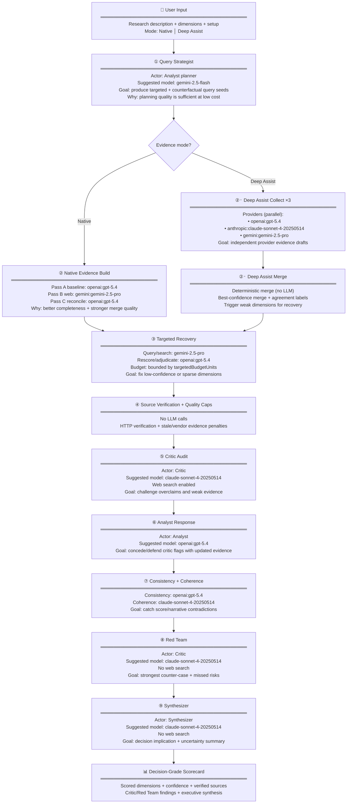

# Pipeline Architecture Suggestions

Suggested model-routing profile to improve reliability and decision-grade quality while keeping spend bounded.

For current implementation flow see [pipeline-architecture.md](./pipeline-architecture.md).

---

## Suggested Scorecard Routing

---

## Suggested Matrix Routing

```mermaid
flowchart TD
    INPUT["🔬 User Input\n════════════════════════════════════════════\nDescription + decision question + subjects + attributes\nMode: Native │ Deep Assist"]

    DISCOVER["① Subject Discovery (optional)\n════════════════════════════════════════════\nActor: Analyst planner\nSuggested model: gemini-2.5-flash\nGoal: discover/expand subjects when list is incomplete\nGuard: deduplicate names before matrix build"]

    BASE["② Baseline Matrix Pass\n════════════════════════════════════════════\nActor: Analyst\nSuggested model: openai:gpt-5.4\nNo web search\nGoal: initial full cell coverage"]

    WEB["③ Web Matrix Pass\n════════════════════════════════════════════\nActor: Analyst retrieval\nSuggested model: gemini-2.5-pro\nWeb search enabled\nGoal: cited evidence per cell"]

    RECON["④ Reconcile Baseline + Web\n════════════════════════════════════════════\nActor: Analyst\nSuggested model: openai:gpt-5.4\nGoal: choose stronger evidence and remove conflicts"]

    TARGETED["⑤ Targeted Recovery (coverage-first)\n════════════════════════════════════════════\nQuery/search: gemini-2.5-pro\nRescore: openai:gpt-5.4 (or mini for low-risk cells)\nSelection priority:\n  1) zero-evidence cells\n  2) low-confidence cells\n  3) contradiction cells\nBudget: adaptive by matrix size"]

    MODE{"Evidence mode?"}

    DA_COLLECT["⑤᛫ Deep Assist Matrix Collect ×3\n════════════════════════════════════════════\nProviders (parallel):\n  • openai:gpt-5.4\n  • anthropic:claude-sonnet-4-20250514\n  • gemini:gemini-2.5-pro\nGoal: independent matrix drafts"]

    DA_MERGE["⑤᛫ Deep Assist Merge + Recovery\n════════════════════════════════════════════\nDeterministic merge + provider agreement labels\nTargeted DA recovery on contradictory/sparse cells"]

    VERIFY["⑥ Source Verification + Coverage Gate\n════════════════════════════════════════════\nNo LLM calls\nVerify URLs/quotes + apply evidence quality caps\nAbort early on catastrophic low coverage"]

    CRITIC["⑦ Critic Audit\n════════════════════════════════════════════\nActor: Critic\nSuggested model: claude-sonnet-4-20250514\nWeb search enabled\nGoal: challenge weak/overstated cells"]

    RESPONSE["⑧ Analyst Response\n════════════════════════════════════════════\nActor: Analyst\nSuggested model: openai:gpt-5.4\nGoal: resolve critic flags for contested cells"]

    CONSISTENCY["⑨ Cross-Matrix Consistency\n════════════════════════════════════════════\nActor: Critic\nSuggested model: claude-sonnet-4-20250514\nGoal: detect illogical row/column relationships"]

    REDTEAM["⑩ Red Team\n════════════════════════════════════════════\nActor: Critic\nSuggested model: claude-sonnet-4-20250514\nNo web search\nGoal: strongest counter-case for decision risk"]

    SYNTH["⑪ Synthesizer\n════════════════════════════════════════════\nActor: Synthesizer\nSuggested model: claude-sonnet-4-20250514\nNo web search\nGoal: decision answer, threats, whitespace, key risks"]

    OUTPUT["📊 Decision-Grade Matrix\n════════════════════════════════════════════\nPer-cell evidence + confidence + verified sources\nCoverage metrics + critic/red-team/synthesis outputs"]

    INPUT --> DISCOVER --> BASE --> WEB --> RECON --> TARGETED --> MODE
    MODE -->|"Native"| VERIFY
    MODE -->|"Deep Assist"| DA_COLLECT --> DA_MERGE --> VERIFY
    VERIFY --> CRITIC --> RESPONSE --> CONSISTENCY --> REDTEAM --> SYNTH --> OUTPUT
```

---

## Practical defaults

- Keep planner/discovery on low-cost models (`gemini-2.5-flash`).
- Use stronger analyst models (`gpt-5.4`, `gemini-2.5-pro`) for evidence-heavy and adjudication-heavy steps.
- Keep critic/red-team/synth on `claude-sonnet-4-20250514` for challenge quality and synthesis stability.
- Prefer adaptive budgets tied to matrix size and prioritize zero-evidence cells first.
- Fail early when coverage cannot meet decision-grade thresholds instead of spending on late-stage critique/synthesis.
