# Pipeline Architecture Suggestion (Actor-Symmetric)

This proposal aligns all runs (Scorecard/Matrix, Native/Deep Assist) to one stage sequence and two LLM actors.

## Actor policy

- `Analyst`: plans research, collects evidence, merges evidence, scores/assesses, recovers low-confidence gaps, and defends against Critic flags.
- `Critic`: challenges weak claims, finds counter-evidence, and pressure-tests decision robustness.
- Deterministic engine steps (verification, source assessment, routing, gates/finalization) are not additional actors.

## Canonical Pipeline (applies to all flows)

```mermaid
flowchart TD
    INTAKE["PROCESS: Input Intake\nGOAL: normalize request into stable schema\nACTOR: deterministic engine\nMODEL: N/A\nINPUT: raw user input + selected type + setup fields\nREQUEST: N/A\nRESPONSE: N/A\nOUTPUT: normalizedRequest"]

    PLAN["PROCESS: Research Planning\nGOAL: define scope, query plan, counterfactual probes\nACTOR: Analyst\nMODEL: gemini-2.5-flash (planning default)\nINPUT: normalizedRequest + research config\nREQUEST: one structured planning call\nRESPONSE: plan JSON (queries, source targets, risk probes)\nOUTPUT: researchPlan"]

    ROUTER{"PROCESS: Evidence Mode Routing\nGOAL: choose Native or Deep Assist collection\nACTOR: deterministic engine\nMODEL: N/A\nINPUT: normalizedRequest.evidenceMode\nREQUEST: N/A\nRESPONSE: N/A\nOUTPUT: selectedCollectionPath"}

    MEM_NATIVE["PROCESS: Evidence Collection (Memory, Native)\nGOAL: create memory-grounded draft evidence\nACTOR: Analyst\nMODEL: openai:gpt-5.4 (or strongest OpenAI available)\nINPUT: normalizedRequest + researchPlan\nREQUEST: structured evidence call (no web search)\nRESPONSE: draft evidence objects\nOUTPUT: memoryEvidenceDraft"]

    WEB_NATIVE["PROCESS: Evidence Collection (Web, Native)\nGOAL: gather cited web evidence for uncovered/weak claims\nACTOR: Analyst\nMODEL: gemini-2.5-pro (web default)\nINPUT: normalizedRequest + researchPlan + memoryEvidenceDraft\nREQUEST: structured web-search evidence call\nRESPONSE: cited findings with source metadata\nOUTPUT: webEvidenceDraft"]

    EVID_DA["PROCESS: Evidence Collection (Deep Assist)\nGOAL: gather full evidence packets (memory + web) from multiple providers\nACTOR: Analyst\nMODEL: openai:gpt-5.4 + claude-sonnet-4 + gemini-2.5-pro\nINPUT: normalizedRequest + researchPlan\nREQUEST: parallel deep-research style calls with provider-side web research\nRESPONSE: per-provider evidence drafts with citations/confidence\nOUTPUT: deepAssistEvidenceProviders"]

    MERGE["PROCESS: Evidence Merge\nGOAL: build one unified evidence bundle\nACTOR: Analyst\nMODEL: openai:gpt-5.4-mini (or stronger if quality requires)\nINPUT: native drafts OR deep-assist provider drafts\nREQUEST: merge/adjudication call and deterministic merge policy\nRESPONSE: merged evidence + agreement signals\nOUTPUT: evidenceBundleV1"]

    SCORE["PROCESS: Scoring / Assessment (if applicable)\nGOAL: map evidence to rubric scores or matrix values\nACTOR: Analyst\nMODEL: openai:gpt-5.4\nINPUT: evidenceBundleV1 + rubric/attribute definitions\nREQUEST: structured scoring call\nRESPONSE: scored dimensions or matrix cells\nOUTPUT: scoredStateV1"]

    CONF["PROCESS: Confidence Assessment\nGOAL: assign calibrated confidence with reasons\nACTOR: Analyst\nMODEL: openai:gpt-5.4-mini\nINPUT: scoredStateV1 + evidence quality indicators\nREQUEST: confidence calibration call\nRESPONSE: confidence levels + confidence reasons\nOUTPUT: assessedStateV1"]

    VERIFY["PROCESS: Source Verification\nGOAL: verify URLs/quotes and set verification status\nACTOR: deterministic engine\nMODEL: N/A\nINPUT: assessedStateV1 sources\nREQUEST: HTTP fetch + quote/name matching\nRESPONSE: fetch/match results per source\nOUTPUT: verifiedStateV1"]

    ASSESS["PROCESS: Source Assessment\nGOAL: apply quality caps/penalties from verification results\nACTOR: deterministic engine\nMODEL: N/A\nINPUT: verifiedStateV1 + quality policy\nREQUEST: N/A\nRESPONSE: N/A\nOUTPUT: qualityAdjustedStateV1"]

    COHERENCE["PROCESS: Consistency + Coherence Check\nGOAL: detect cross-item contradictions and logic breaks\nACTOR: Critic\nMODEL: claude-sonnet-4-0 (recommended alias)\nINPUT: qualityAdjustedStateV1\nREQUEST: structured consistency/coherence review call\nRESPONSE: contradiction flags + suggested corrections\nOUTPUT: coherenceFindings"]

    RECOVER["PROCESS: Extra Evidence for Low Confidence\nGOAL: recover low-confidence or sparse-evidence areas\nACTOR: Analyst\nMODEL: gemini-2.5-pro (search) + openai:gpt-5.4 (re-assess)\nINPUT: qualityAdjustedStateV1 + coherenceFindings + researchPlan\nREQUEST: targeted plan + web search + focused reassessment\nRESPONSE: incremental evidence patches\nOUTPUT: recoveredEvidencePatch"]

    RESCORE["PROCESS: Re-score + Confidence Re-assessment\nGOAL: update scores/values/confidence after recovery\nACTOR: Analyst\nMODEL: openai:gpt-5.4\nINPUT: qualityAdjustedStateV1 + recoveredEvidencePatch\nREQUEST: structured update call\nRESPONSE: updated scoring + confidence\nOUTPUT: assessedStateV2"]

    CHALLENGE["PROCESS: Challenge Overclaims + Weak Evidence\nGOAL: pressure-test strongest claims and overconfidence\nACTOR: Critic\nMODEL: claude-sonnet-4-0 (recommended alias)\nINPUT: assessedStateV2\nREQUEST: structured challenge/audit call\nRESPONSE: critic flags with rationale\nOUTPUT: criticFlags"]

    COUNTER["PROCESS: Counter-case + Missed Risks (Web)\nGOAL: find disconfirming evidence and unmodeled risks\nACTOR: Critic\nMODEL: claude-sonnet-4-0 (web enabled)\nINPUT: assessedStateV2 + criticFlags\nREQUEST: targeted web-search counter-case call\nRESPONSE: counter-evidence + missed-risk findings\nOUTPUT: criticCounterPack"]

    DEFEND["PROCESS: Concede / Defend with Updated Evidence\nGOAL: resolve critic objections explicitly\nACTOR: Analyst\nMODEL: openai:gpt-5.4\nINPUT: assessedStateV2 + criticFlags + criticCounterPack\nREQUEST: structured concede/defend adjudication call\nRESPONSE: accepted/rejected flags + revised reasoning\nOUTPUT: resolvedState"]

    FINAL["PROCESS: Final Confidence + Final Scores/Values\nGOAL: lock final output and decision-grade status\nACTOR: Analyst + deterministic engine\nMODEL: openai:gpt-5.4-mini (summary) + deterministic gates\nINPUT: resolvedState + quality gates\nREQUEST: final summarization call + deterministic checks\nRESPONSE: final narrative + decision implications\nOUTPUT: finalResearchArtifact"]

    INTAKE --> PLAN --> ROUTER
    ROUTER -->|Native| MEM_NATIVE --> WEB_NATIVE --> MERGE
    ROUTER -->|Deep Assist| EVID_DA --> MERGE
    MERGE --> SCORE --> CONF --> VERIFY --> ASSESS --> COHERENCE --> RECOVER --> RESCORE --> CHALLENGE --> COUNTER --> DEFEND --> FINAL
```



## Scorecard vs Matrix adaptation (within the same stages)

- Stage `6` output:
  - Scorecard: per-dimension scores.
  - Matrix: per-cell values/scores across subjects × attributes.
- Stage `10` consistency:
  - Scorecard: cross-dimension coherence.
  - Matrix: cross-row/cross-column logic and comparability.
- Stage `11` recovery target unit:
  - Scorecard: dimension.
  - Matrix: cell (or bounded cell-group when quality-equivalent).

## Model selection principles (quality-bar aligned)

- High-impact reasoning steps use stronger models.
- Planning/merge/calibration can use cheaper models only when quality is not materially reduced.
- Analyst web collection routes through Gemini.
- Critic challenge and counter-case web search route through Claude by default.
- No silent degraded fallback in strict quality mode; failures should stop with explicit diagnostics.
- For deterministic reproducibility, pin snapshots; for best-current quality, use approved latest aliases.

## Refactor scope and success criteria

This document is the implementation spec for a large pipeline refactor. Success criteria:

1. One canonical stage graph for all run types (Scorecard/Matrix, Native/Deep Assist).
2. Only two reasoning actors: `Analyst` and `Critic`.
3. `Native` and `Deep Assist` differ only inside evidence collection, then converge to the same downstream stages.
4. No silent quality degradation in strict mode: unrecoverable failures must abort with explicit reason code and downloadable debug bundle.
5. Architecture and behavior are aligned with [quality-bar.md](./quality-bar.md).

## Real-run failure findings that this spec must address

These are observed from real debug runs and postmortems, not hypothetical risks.

| Finding | Observed symptom | Required design response |
| --- | --- | --- |
| Token overflow in late critic phases | Critic prompt exceeded context (`~200k+` tokens) | Prompt compaction before call; hard token preflight; split/condense strategy; bounded retries |
| Parse failure in matrix web passes | Web chunk returned malformed/truncated JSON | Parse-retry policy with reduced chunk scope and lower verbosity before fail |
| Long-running web step stalls | Single matrix web step took ~40+ minutes | Step timeout + adaptive chunk splitting + bounded retry |
| Fixed recovery budget starvation | Large matrix had far more weak cells than budget (e.g., 84 weak vs 36 budget) | Size-aware adaptive budgets with per-attribute/cell coverage floor |
| Duplicate discovered subjects | Semantic duplicates consumed budget and diluted evidence | Canonicalization + dedup merge before scoring/recovery |
| Reconcile no-op accepted | Reconcile applied with near-zero useful changes | Reconcile acceptance gate with minimum lift metrics |
| Route/model drift risk | Wrong provider/model path consumed tokens with low trust | Strict actor-route preflight and hard stop on mismatch |
| “Finished but hollow” outputs | Run completed with low decision usefulness | Early catastrophic coverage gate + hard abort criteria |

## Canonical runtime contracts

### Global run state

Every stage receives and returns a shared state envelope:

```ts
type RunState = {
  runId: string;
  mode: "native" | "deep-assist";
  outputType: "scorecard" | "matrix";
  request: NormalizedRequest;
  plan: ResearchPlan | null;
  evidence: EvidenceBundle | null;
  assessment: AssessmentState | null;
  critique: CriticState | null;
  quality: QualityState;
  diagnostics: DiagnosticsState;
};
```

### Stage IO contract

All stages must emit:

- `stageStatus`: `ok | recovered | failed`
- `reasonCodes[]`: deterministic machine-readable codes
- `metrics`: duration, request counts, token estimates/actuals, retry count
- `statePatch`: additive patch to `RunState`

## Stage behavior specification

1. `Input Intake`
- Validate required fields for selected config.
- Normalize user framing into structured fields used by prompts.
- Fail if required inputs are missing.

2. `Research Planning` (Analyst)
- Produce scoped queries and counterfactual probes.
- Must produce plan entries for every dimension/attribute.
- If plan quality is insufficient, retry once with stricter schema.

3-4. `Evidence Collection`
- `Native`: memory pass then web pass.
- `Deep Assist`: single provider-parallel collection stage with full evidence packets (memory+web).
- Both paths must output the same `EvidenceBundle` schema before merge.

5. `Evidence Merge` (Analyst + deterministic rules)
- Merge by evidence quality/confidence and provider agreement.
- Must preserve provenance (`provider`, `step`, `source`).

6-7. `Scoring/Assessment + Confidence`
- Score/assess only after evidence bundle completeness check.
- Confidence reasons required for each score/cell.

8-9. `Source Verification + Source Assessment` (deterministic)
- URL fetch + quote/name checks + source-type classification.
- Apply quality caps consistently across scorecard and matrix.

10. `Consistency + Coherence` (Critic)
- Catch contradictions, non-comparable scoring, and unsupported conclusions.

11-12. `Extra evidence + re-score/re-confidence`
- Recovery is coverage-first, not convenience-first.
- Prioritize zero-evidence areas and critical attributes first.

13-15. `Critic challenge -> counter-case web -> Analyst concede/defend`
- Critic flags must be explicit and traceable.
- Analyst response must map flag-by-flag with concede/defend outcome.

16. `Finalization`
- Apply decision-grade gate.
- Emit final artifact only if quality gates pass, else abort/fail state per policy.

## Routing and model policy (enforced)

### Actor-level guarantees

- `Analyst`
  - High-impact reasoning/scoring: strongest OpenAI route configured for the environment.
  - Web evidence collection: Gemini route.
  - Cheaper OpenAI route allowed only for low-risk merge/calibration steps.
- `Critic`
  - Challenge/counter-case: Claude route by default.
  - Web counter-case uses Claude web-enabled route.
  - Cheaper Claude route allowed only where quality impact is proven negligible.

### Strict route preflight

Before first spend:

- Resolve effective provider/model per stage.
- Compare with expected actor policy.
- If mismatch: fail immediately (`route_mismatch_preflight`) before LLM calls.

## Token, timeout, retry, and budget policy

### Token policy

- Every LLM stage uses token preflight estimation.
- If estimated prompt exceeds stage budget:
  - compact context,
  - then split scope,
  - then retry once.
- If still over budget: fail with explicit reason code.

### Timeout policy

- Per-stage hard timeout with bounded retries.
- Retry strategy:
  - reduce scope/chunk size,
  - reduce verbosity,
  - preserve required schema.
- Exhausted retries => stage failure (no silent continuation in strict mode).

### Budget policy

- Recovery budget scales by matrix size / weak-cell volume.
- Coverage floor per attribute/dimension is mandatory before pressure-based allocation.
- No fixed budget constants that starve large matrices.

## Quality gates and abort criteria

In strict quality mode, abort when any condition proves decision-grade output is unattainable:

- unrecoverable parse failures,
- catastrophic post-recovery coverage shortfall,
- unresolved critical evidence minimums,
- route/model preflight mismatch,
- token/timeout retry exhaustion on required stages.

Expected UX behavior:

- show explicit failure popup with `reasonCode`,
- offer immediate `Download Debug Log` action,
- preserve run state and diagnostics for troubleshooting.

## Diagnostics and debug log contract

Debug bundle must include enough detail for both reliability debugging and output-quality analysis.

Required sections:

- `run`: run id, mode, config id/version, timestamps
- `routing`: resolved provider/model per stage, including aliases/snapshots
- `stages[]`:
  - stage name, status, reason codes, durations, retry attempts
  - token estimates + provider usage reported
  - timeout and chunking decisions
- `io`:
  - prompt metadata and compaction metadata
  - raw model response text (redacted only for secrets/PII if required)
  - parse errors and repair attempts
- `quality`:
  - coverage metrics, source verification stats, critic flags, gate outcomes
- `cost` (estimated):
  - per-stage, per-provider/model spend estimate and totals

## Normative implementation requirements

The following keywords are normative:

- `MUST`: required for compliance with this spec.
- `SHOULD`: strongly recommended unless explicit documented exception exists.
- `MAY`: optional implementation detail.

Core requirements:

1. Pipeline behavior `MUST` be stage-driven, not prompt-chain-driven.
2. Native and Deep Assist `MUST` converge to the same post-merge stages.
3. Actor routing `MUST` pass strict preflight before first paid request.
4. Strict mode `MUST` abort on unrecoverable quality-risk states.
5. Debug bundles `MUST` include enough raw IO and metadata to replay downstream logic offline.

## Detailed data contracts (canonical)

```ts
type EvidenceMode = "native" | "deep-assist";
type OutputType = "scorecard" | "matrix";
type StageStatus = "ok" | "recovered" | "failed";
type Confidence = "high" | "medium" | "low";

type NormalizedRequest = {
  outputType: OutputType;
  evidenceMode: EvidenceMode;
  researchConfigId: string;
  titleHint?: string;
  objective: string;
  decisionQuestion?: string;
  scopeContext?: string;
  roleContext?: string;
  scorecard?: {
    dimensions: Array<{ id: string; label: string; weight: number; rubric: string; brief: string }>;
  };
  matrix?: {
    subjects: Array<{ id: string; label: string; aliases?: string[] }>;
    attributes: Array<{ id: string; label: string; brief: string; derived?: boolean }>;
  };
};

type ResearchPlan = {
  niche?: string;
  aliases?: string[];
  units: Array<{
    unitId: string; // dimension id (scorecard) or attribute/cell key (matrix planning granularity)
    supportingQueries: string[];
    counterfactualQueries: string[];
    sourceTargets: string[];
    gapHypothesis?: string;
  }>;
};

type SourceRef = {
  name: string;
  url?: string;
  quote?: string;
  sourceType?: string;
  provider?: string;
  verificationStatus?: "verified_in_page" | "name_only_in_page" | "not_found_in_page" | "fetch_failed" | "invalid_url";
  displayStatus?: "cited" | "corroborating" | "excluded_marketing" | "excluded_stale" | "unverified";
  publishedYear?: number | null;
};

type ArgumentRef = {
  id: string;
  claim: string;
  detail?: string;
  side: "supporting" | "limiting";
  sources: SourceRef[];
};

type ScorecardUnit = {
  id: string;
  score: number;
  confidence: Confidence;
  confidenceReason: string;
  brief: string;
  full: string;
  sources: SourceRef[];
  arguments: { supporting: ArgumentRef[]; limiting: ArgumentRef[] };
  risks?: string;
  missingEvidence?: string;
  providerAgreement?: "agree" | "partial" | "contradict";
};

type MatrixCell = {
  subjectId: string;
  attributeId: string;
  value: string;
  confidence: Confidence;
  confidenceReason: string;
  full?: string;
  sources: SourceRef[];
  arguments: { supporting: ArgumentRef[]; limiting: ArgumentRef[] };
  risks?: string;
  providerAgreement?: "agree" | "partial" | "contradict";
};

type EvidenceBundle = {
  scorecard?: { dimensions: ScorecardUnit[] };
  matrix?: { cells: MatrixCell[] };
  providerContributions?: Array<{ provider: string; success: boolean; durationMs: number }>;
};

type CriticFlag = {
  unitKey: string; // dimensionId or subjectId::attributeId
  flagged: boolean;
  note: string;
  suggestedScore?: number;
  suggestedValue?: string;
  suggestedConfidence?: Confidence;
  sources?: SourceRef[];
};

type QualityState = {
  strictQuality: boolean;
  qualityGrade: "decision-grade" | "degraded" | "failed";
  reasonCodes: string[];
  coverage: {
    totalUnits: number;
    coveredUnits: number;
    lowConfidenceUnits: number;
    zeroEvidenceUnits: number;
  };
  sourceUniverse: {
    cited: number;
    corroborating: number;
    unverified: number;
    excludedMarketing: number;
    excludedStale: number;
  };
};

type StageRecord = {
  stage: string;
  status: StageStatus;
  startedAt: string;
  endedAt: string;
  reasonCodes: string[];
  retries: number;
  durationMs: number;
  modelRoute?: { actor: "analyst" | "critic"; provider: string; model: string; liveSearch?: boolean };
  tokens?: { estimatedInput?: number; providerInput?: number; providerOutput?: number; cachedInput?: number };
};
```

## Reason code catalog (required)

All failures/recoveries must use stable reason codes.

- Routing / setup
  - `route_mismatch_preflight`
  - `missing_required_input`
  - `invalid_config_schema`
- Token / prompt
  - `prompt_token_over_budget`
  - `prompt_compaction_applied`
  - `prompt_compaction_exhausted`
- Time / retries
  - `stage_timeout`
  - `retry_exhausted`
  - `rate_limit_backoff_exhausted`
- Parse / schema
  - `response_parse_failed`
  - `response_schema_invalid`
  - `partial_payload_rejected`
- Coverage / quality
  - `coverage_catastrophic`
  - `decision_gate_failed`
  - `critical_units_unresolved`
  - `reconcile_rejected_no_lift`
  - `recovery_budget_starved`
- Source quality
  - `source_verification_failed`
  - `source_quality_capped`
- Run outcome
  - `run_aborted_strict_quality`
  - `run_completed_degraded`

## Stage budgets and operational defaults (spec defaults)

These are target defaults for the refactored pipeline. Config must keep them overridable.

| Stage | Output type | Timeout | Retry max | Target token budget | Notes |
| --- | --- | --- | --- | --- | --- |
| Planning | both | 45s | 1 | 4k | must cover all dimensions/attributes |
| Native memory evidence | scorecard | 75s | 1 | 8k | split by dimension if needed |
| Native memory evidence | matrix | 90s | 2 | 10k | chunk by subject groups |
| Native web evidence | scorecard | 90s | 2 | 10k | Gemini web route |
| Native web evidence | matrix | 120s | 2 | 12k | adaptive chunking mandatory |
| Deep Assist provider pass | both | 20m | 0 | provider-managed | monitor heartbeat/progress |
| Merge | both | 45s | 1 | 6k | may be deterministic+LLM |
| Scoring / confidence | both | 60s | 1 | 6k | ensure schema-validated outputs |
| Consistency/coherence | both | 75s | 1 | 8k | critic route |
| Targeted recovery search | both | 90s | 2 | 8k | per targeted unit or small unit-group |
| Critic challenge/counter | both | 90s | 1 | 8k | counter-case may use web |
| Finalize | both | 45s | 1 | 4k | summary + deterministic gate |

## Retry and fallback matrix (strict quality)

No provider/model failover is allowed in strict mode. Retry is same-route only.

| Failure class | First response | Second response | Terminal behavior |
| --- | --- | --- | --- |
| Timeout | retry with smaller scope | retry with smaller scope + reduced verbosity | fail with `retry_exhausted` |
| Parse failure | retry with schema-repair prompt | retry with smaller scope | fail with `response_parse_failed` |
| Token overflow | compact prompt | split scope + compact | fail with `prompt_compaction_exhausted` |
| Rate limit | bounded backoff | bounded backoff | fail with `rate_limit_backoff_exhausted` |
| Missing required units | targeted fill pass | targeted fill pass with higher priority | fail with `critical_units_unresolved` |

## Deterministic algorithms (required)

### A) Adaptive matrix chunking

1. Start chunk size from config (`matrix.chunkSizeStart`, default 4 subjects).
2. On timeout/parse/token failure:
   - halve chunk size (`max(1, floor(size/2))`),
   - reduce response verbosity target,
   - retry.
3. Record chunk decisions in diagnostics.

### B) Coverage-first recovery allocation

1. Compute pressure per unit:
   - contradiction +5
   - low confidence +4
   - zero evidence +4
   - sparse sources +2
   - stale-heavy evidence +2
2. Reserve mandatory floor:
   - at least one recovery slot per uncovered critical attribute/dimension.
3. Allocate remaining slots by pressure descending.
4. If no net lift on pass-1, allow one bounded pass-2.

### C) Reconcile acceptance gate

Reject reconcile result if all true:

- confidence lift < configured threshold,
- low-confidence count not reduced,
- source coverage not improved,
- contradiction count not reduced.

Fallback: keep best prior draft and continue recovery planning.

### D) Provider agreement scoring (Deep Assist)

Per unit/cell agreement:

- `agree`: semantic overlap >= `T_high`
- `partial`: `T_low <= overlap < T_high`
- `contradict`: overlap < `T_low`

Thresholds are config-controlled and logged per run.

## Decision-grade gate formulas (required)

Minimum checks (both scorecard and matrix; matrix applies per-cell equivalents):

1. Coverage:
- `coveredUnits / totalUnits >= minCoverageRatio`
2. Confidence:
- `lowConfidenceUnits / totalUnits <= maxLowConfidenceRatio`
3. Source sufficiency:
- each critical unit has `>= minSourcesPerCriticalUnit`
- each critical unit has `>= minIndependentSourcesPerCriticalUnit`
4. Critic resolution:
- unresolved critic flags <= `maxUnresolvedCriticFlags`
5. Red-team severity:
- no unresolved `severity=high` without explicit analyst mitigation note.

If any fail in strict mode: abort.

## Progress/UI contract

Progress reporting must map 1:1 to canonical stages:

- stage id, title, status, started/ended time, retries, reason codes.
- when failed:
  - show failure popup with top reason code + brief explanation,
  - include `Download Debug Log` action.
- avoid legacy phase names that imply old architecture (no parallel legacy naming).

## Backward compatibility and migration

1. Keep old import/export JSON readable via adapter layer.
2. Store artifact version (`artifactVersion`) and pipeline version (`pipelineVersion`).
3. Add migration transforms:
- legacy phase names -> canonical stages
- legacy evidence fields -> canonical `SourceRef/ArgumentRef`
- legacy flags -> `CriticFlag`

## Refactor completion checklist

A refactor is complete only when all are true:

- [ ] Canonical stage orchestrator exists and is shared by scorecard/matrix.
- [ ] Native and Deep Assist converge at identical post-merge stages.
- [ ] Strict route preflight blocks mismatched actor/model routes.
- [ ] Token/timeout/parse guardrails with bounded retries are enforced.
- [ ] Coverage-first recovery allocator is active and tested.
- [ ] Decision-grade gates are enforced for scorecard and matrix.
- [ ] Debug bundle contract includes raw stage IO + model usage + reason codes.
- [ ] UI progress and failure popup consume canonical stage diagnostics.
- [ ] Replay tests pass using captured debug fixtures without real provider calls.

## Code architecture target

Refactor into modular stage orchestrator:

- `engine/pipeline/stages/*`:
  - one module per canonical stage
- `engine/pipeline/contracts/*`:
  - shared IO schemas and reason codes
- `engine/lib/guards/*`:
  - token preflight, timeout, retry, coverage/decision gates
- `engine/lib/diagnostics/*`:
  - unified stage logging and debug bundle assembly
- `engine/lib/routing/*`:
  - strict actor model resolution and preflight

Shared utilities must be centralized to prevent scorecard/matrix divergence.

## Refactor rollout plan (recommended)

1. Contract first
- Introduce canonical `RunState`, stage IO schema, and reason codes.

2. Orchestrator spine
- Build shared orchestrator executing current logic through adapters.

3. Evidence collection unification
- Implement Native/Deep Assist convergence into one evidence bundle contract.

4. Guardrails hardening
- Add token preflight, timeout split-retry, adaptive budget, strict abort.

5. Quality/debug completeness
- Enforce full diagnostics contract and verify downloadable bundles.

6. Cutover
- Replace old per-pipeline branching with stage modules, remove dead paths.

## Test strategy required before cutover

- Unit tests:
  - stage contracts,
  - reason code emission,
  - route preflight behavior,
  - token/timeout/budget guards.
- Replay tests:
  - run with captured response fixtures from debug bundles (no real provider calls),
  - validate deterministic downstream behavior and gates.
- Integration tests:
  - one scorecard native,
  - one matrix native,
  - one scorecard deep-assist,
  - one matrix deep-assist,
  - each with expected pass/fail gate assertions.
