# Pipeline Architecture Suggestion (Actor-Symmetric)

This proposal aligns all runs (Scorecard/Matrix, Native/Deep Assist) to one stage sequence and two LLM actors.

## Actor policy

- `Analyst`: plans research, collects evidence, merges, scores/assesses, recovers low-confidence gaps, and defends against Critic flags.
- `Critic`: challenges weak claims, finds counter-evidence, and tests decision robustness.
- Deterministic engine steps (verification, quality caps, routing, finalization) are not additional actors.

## Canonical Pipeline (applies to all flows)

```mermaid
flowchart TD
    INTAKE["1) Input Intake\nGoal: normalize request into a stable schema\nActor: deterministic engine\nModel: N/A\nInput: raw user input + selected research type + setup fields\nRequest: N/A\nResponse: N/A\nOutput: normalizedRequest"]

    PLAN["2) Research Planning\nGoal: define scope, search plan, and counterfactual probes\nActor: Analyst\nModel: gemini-2.5-flash (planning default)\nInput: normalizedRequest + research config\nRequest: one structured planning call\nResponse: plan JSON (queries, source targets, risk probes)\nOutput: researchPlan"]

    ROUTER{"Evidence Collection Mode Router\nGoal: select Native or Deep Assist collection path\nActor: deterministic engine\nModel: N/A\nInput: normalizedRequest.evidenceMode\nRequest: N/A\nResponse: N/A\nOutput: selected path"}

    MEM_NATIVE["3) Evidence Collection (Memory, Native)\nGoal: produce memory-only draft evidence\nActor: Analyst\nModel: openai:gpt-5.4 (or strongest OpenAI available)\nInput: normalizedRequest + researchPlan\nRequest: structured evidence call, no web search\nResponse: draft evidence objects\nOutput: memoryEvidenceDraft"]

    MEM_DA["3) Evidence Collection (Memory, Deep Assist)\nGoal: collect independent memory-grounded drafts\nActor: Analyst\nModel: openai:gpt-5.4 + claude-sonnet-4 + gemini-2.5-pro\nInput: normalizedRequest + researchPlan\nRequest: parallel deep-research style structured calls\nResponse: provider drafts with confidence + rationale\nOutput: memoryEvidenceProviders"]

    WEB_NATIVE["4) Evidence Collection (Web, Native)\nGoal: gather cited web evidence for uncovered/weak claims\nActor: Analyst\nModel: gemini-2.5-pro (web default)\nInput: normalizedRequest + researchPlan + memory evidence\nRequest: structured web-search evidence call\nResponse: cited findings with source metadata\nOutput: webEvidenceDraft"]

    WEB_DA["4) Evidence Collection (Web, Deep Assist)\nGoal: collect independent web-grounded drafts\nActor: Analyst\nModel: openai:gpt-5.4 + claude-sonnet-4 + gemini-2.5-pro\nInput: normalizedRequest + researchPlan + provider memory drafts\nRequest: parallel deep-research style web-grounded calls\nResponse: provider web drafts with citations\nOutput: webEvidenceProviders"]

    MERGE["5) Evidence Merge\nGoal: build one unified evidence bundle\nActor: Analyst\nModel: openai:gpt-5.4-mini (or stronger when needed)\nInput: memory + web drafts (native or provider-based)\nRequest: merge/adjudication call or deterministic merge policy\nResponse: merged evidence with agreement signals\nOutput: evidenceBundleV1"]

    SCORE["6) Scoring / Assessment (if applicable)\nGoal: map evidence to rubric scores or matrix values\nActor: Analyst\nModel: openai:gpt-5.4\nInput: evidenceBundleV1 + rubric/attribute definitions\nRequest: structured scoring call\nResponse: scored dimensions or matrix cells\nOutput: scoredStateV1"]

    CONF["7) Confidence Assessment\nGoal: assign calibrated confidence with reasons\nActor: Analyst\nModel: openai:gpt-5.4-mini\nInput: scoredStateV1 + evidence quality indicators\nRequest: confidence calibration call\nResponse: confidence levels + confidence reasons\nOutput: assessedStateV1"]

    VERIFY["8) Source Verification\nGoal: verify URLs/quotes and classify verification status\nActor: deterministic engine\nModel: N/A\nInput: assessedStateV1 sources\nRequest: HTTP fetch + quote/name matching\nResponse: fetch/match results per source\nOutput: verifiedStateV1"]

    ASSESS["9) Source Assessment\nGoal: apply quality caps/penalties using verification results\nActor: deterministic engine\nModel: N/A\nInput: verifiedStateV1 + quality policy\nRequest: N/A\nResponse: N/A\nOutput: qualityAdjustedStateV1"]

    COHERENCE["10) Consistency + Coherence Check\nGoal: detect cross-item contradictions and logic breaks\nActor: Critic\nModel: claude-sonnet-4-20250514\nInput: qualityAdjustedStateV1\nRequest: structured consistency/coherence review call\nResponse: contradiction flags + suggested corrections\nOutput: coherenceFindings"]

    RECOVER["11) Extra Evidence for Low Confidence\nGoal: recover low-confidence or sparse-evidence areas\nActor: Analyst\nModel: gemini-2.5-pro (search) + openai:gpt-5.4 (rescore)\nInput: qualityAdjustedStateV1 + coherenceFindings + researchPlan\nRequest: targeted query plan + web search + focused reassessment\nResponse: incremental evidence patches\nOutput: recoveredEvidencePatch"]

    RESCORE["12) Re-score + Confidence Re-assessment\nGoal: update scores/values/confidence after recovery\nActor: Analyst\nModel: openai:gpt-5.4\nInput: qualityAdjustedStateV1 + recoveredEvidencePatch\nRequest: structured update call\nResponse: updated scoring + confidence\nOutput: assessedStateV2"]

    CHALLENGE["13) Challenge Overclaims and Weak Evidence\nGoal: stress-test strongest claims and overconfidence\nActor: Critic\nModel: claude-sonnet-4-20250514\nInput: assessedStateV2\nRequest: structured challenge/audit call\nResponse: critic flags with rationale\nOutput: criticFlags"]

    COUNTER["14) Counter-case + Missed Risks (Web)\nGoal: find disconfirming evidence and unmodeled risks\nActor: Critic\nModel: claude-sonnet-4-20250514 (web enabled)\nInput: assessedStateV2 + criticFlags\nRequest: targeted web-search counter-case call\nResponse: counter-evidence + missed-risk findings\nOutput: criticCounterPack"]

    DEFEND["15) Concede / Defend with Updated Evidence\nGoal: resolve critic objections explicitly\nActor: Analyst\nModel: openai:gpt-5.4\nInput: assessedStateV2 + criticFlags + criticCounterPack\nRequest: structured concede/defend adjudication call\nResponse: accepted/rejected flags + revised reasoning\nOutput: resolvedState"]

    FINAL["16) Final Confidence + Final Scores/Values\nGoal: lock final output and decision-grade status\nActor: Analyst + deterministic engine\nModel: openai:gpt-5.4-mini (summary) + deterministic gates\nInput: resolvedState + quality gates\nRequest: final summarization call + deterministic gate checks\nResponse: final narrative + decision implications\nOutput: finalResearchArtifact"]

    INTAKE --> PLAN --> ROUTER
    ROUTER -->|Native| MEM_NATIVE --> WEB_NATIVE --> MERGE
    ROUTER -->|Deep Assist| MEM_DA --> WEB_DA --> MERGE
    MERGE --> SCORE --> CONF --> VERIFY --> ASSESS --> COHERENCE --> RECOVER --> RESCORE --> CHALLENGE --> COUNTER --> DEFEND --> FINAL
```

## Scorecard vs Matrix adaptation (within the same stages)

- Stage `6` output:
  - Scorecard: per-dimension scores.
  - Matrix: per-cell values/scores across subjects × attributes.
- Stage `10` consistency:
  - Scorecard: cross-dimension coherence.
  - Matrix: cross-row/cross-column logic and comparability.
- Stage `11` recovery target unit:
  - Scorecard: dimension.
  - Matrix: cell (or bounded cell-group where quality-equivalent).

## Model selection principles (quality-bar aligned)

- High-impact reasoning steps use stronger models.
- Planning/merge/calibration use cheaper models only when quality is not materially reduced.
- Analyst web collection routes through Gemini.
- Critic challenge and critic web counter-case route through Claude by default.
- No silent degraded fallback in strict quality mode; failures should stop with explicit diagnostics.
