# Pipeline Architecture

Detailed research flow for both pipeline modes. For project overview see [README.md](../README.md); for system architecture see [architecture.md](architecture.md).

---

## Scorecard Pipeline

Evaluates a research question across weighted dimensions. Each dimension receives an independent score, confidence level, evidence trail, and structured arguments.

```mermaid
flowchart TD
    INPUT["🔬 User Input\n─────────────────────\nResearch description\nDimensions with weights\nResearch setup context\nEvidence mode selection"]

    QS["① Query Strategist\n─────────────────────\nActor: Analyst LLM (retrieval)\nRequest: 1 LLM call, no web search\n─────────────────────\nInfers niche & domain\nGenerates per-dimension query seeds\nGenerates counterfactual queries (RQ-05)\nProduces alias/rebrand hints"]

    P1["② Analyst Phase 1 — Evidence\n─────────────────────\nActor: Analyst LLM with web search\nRequest: 1 LLM call, live web search\n─────────────────────\nCollects web evidence per dimension\nProduces scores + confidence levels\nBuilds supporting & limiting arguments\nIdentifies missing evidence gaps\nExtracts and normalizes sources"]

    DA_CHECK{"Evidence mode?"}

    DA_PARALLEL["② Deep Research ×3 — Collect\n─────────────────────\nActors: ChatGPT + Claude + Gemini\nRequests: 3 LLM calls in parallel, each with web search\n─────────────────────\nEach provider runs full analyst pass independently\nEach returns complete scorecard with sources\nPer-provider meta tracks timing & search usage"]

    DA_MERGE["② Deep Research ×3 — Merge\n─────────────────────\nNo LLM call (deterministic logic)\n─────────────────────\nPick highest-confidence provider per dimension\nAverage scores across providers\nMerge source lists, deduplicate\nCompute providerAgreement per dimension\n(agree / partial / contradict)"]

    DA_RECOVER["② Deep Research ×3 — DA-02 Recovery\n─────────────────────\nTrigger: provider contradictions, low confidence, sparse sources\nSelection: selectDeepAssistRecoveryDimensions() ranks by pressure\n─────────────────────\nPer weak dimension (sequential):\n  → Query Plan LLM call (supporting + counterfactual)\n  → Search Harvest LLM call (with web search)\n  → Rescore LLM call (weigh new evidence)\nCounterfactual findings feed limiting arguments"]

    TARGETED["③ Targeted Recovery\n─────────────────────\nTrigger: dimensions still at low confidence\nSelection: selectTargetedCycleDimensions() ranks by pressure\n─────────────────────\nPer weak dimension (sequential):\n  → Query Plan: 3-4 supporting + 2-3 counterfactual queries\n  → Search Harvest: execute queries with web search\n  → Rescore: update score/confidence with new evidence\nRefinement pass if no dimensions upgraded"]

    SV1["④ Source Verification\n─────────────────────\nNo LLM call (HTTP fetches)\n─────────────────────\nFetch each source URL\nCheck if quoted text appears in page\nAssign verificationStatus:\n  verified_in_page | name_only | not_found | fetch_failed\nDerive displayStatus (UX-02):\n  cited | corroborating | unverified | excluded\nApply confidence penalties for unverified sources\nCap confidence for stale/vendor-heavy evidence"]

    CRITIC["⑤ Critic Audit\n─────────────────────\nActor: Critic LLM (Anthropic) with web search\nRequest: 1 LLM call, live web search\n─────────────────────\nIndependent adversarial review of all dimensions\nPer dimension: agreedScore, proposedScore, flag, flagReason\nCritic brings own sources (also verified)\nFlags where critic disagrees with analyst"]

    RECONCILE["⑥ Reconciler\n─────────────────────\nActor: Analyst LLM, no web search\nRequest: 1 LLM call\n─────────────────────\nReceives analyst scores + critic flags + critic sources\nAccepts or rejects each flag with justification\nUpdates scores, confidence, arguments\nPolarity enforcement: score cannot move opposite\nto critic direction when critic has evidence"]

    CONSISTENCY["⑦ Consistency & Coherence\n─────────────────────\nRequests: 2 LLM calls, no web search\n─────────────────────\nConsistency: ensures score ordering is internally logical\nCoherence: checks cross-dimension narrative\nfor contradictions and flags them"]

    SV2["⑧ Final Source Verification\n─────────────────────\nSame as step ④\nRe-verifies sources added during critic/reconciler"]

    REDTEAM["⑨ Red Team (RQ-02)\n─────────────────────\nActor: Critic LLM, no web search\nRequest: 1 LLM call\n─────────────────────\nConstructs strongest case against the conclusion\nPer dimension: threat, missedRisk, severityIfWrong\nDoes NOT change scores\nAppends risk context to each dimension"]

    SYNTH["⑩ Synthesizer (RQ-09)\n─────────────────────\nActor: Synthesizer LLM (different model from analyst)\nRequest: 1 LLM call, no web search\n─────────────────────\nReceives structured signals only, no raw prose\nProduces: executiveSummary, decisionImplication,\nkeyUncertainties, dissent\nReplaces analyst conclusion with synthesizer's"]

    DISCOVER["⑪ Discovery\n─────────────────────\nActor: Analyst LLM\nRequest: 1 LLM call\n─────────────────────\nSuggests follow-up research threads\nbased on gaps and findings"]

    OUTPUT["📊 Final Scorecard Output\n─────────────────────\nPer-dimension: finalScore, confidence, brief,\nfull evidence, sources with displayStatus,\narguments (supporting + limiting), risks + red team\nTop-level: weightedScore, conclusion,\nexecutiveSummary, redTeam, sourceUniverse,\nanalysisMeta diagnostics, discovery suggestions"]

    INPUT --> QS --> P1 --> DA_CHECK
    DA_CHECK -->|"Verified Research (native)"| TARGETED
    DA_CHECK -->|"Deep Research ×3"| DA_PARALLEL --> DA_MERGE --> DA_RECOVER --> SV1
    TARGETED --> SV1 --> CRITIC --> RECONCILE --> CONSISTENCY --> SV2 --> REDTEAM --> SYNTH --> DISCOVER --> OUTPUT
```

---

## Matrix Pipeline

Compares multiple subjects across multiple attributes. Each cell (subject × attribute) receives independent evidence, confidence, and structured arguments.

```mermaid
flowchart TD
    INPUT["🔬 User Input\n─────────────────────\nResearch description\nDecision question\nSubjects (or auto-discover)\nAttributes with weights\nEvidence mode selection"]

    SD["① Subject Discovery (optional)\n─────────────────────\nActor: Analyst LLM\nRequest: 1 LLM call\n─────────────────────\nTrigger: no subjects provided + discover=true\nAuto-discovers comparison subjects\nfrom the research question\n(e.g., competitor products)"]

    QS["② Query Strategist\n─────────────────────\nActor: Analyst LLM (retrieval)\nRequest: 1 LLM call, no web search\n─────────────────────\nInfers niche, aliases, rebrand hints\nPer low-confidence cell:\n  query seeds + counterfactual seeds + source targets"]

    ANALYST["③ Analyst Pass — Populate Grid\n─────────────────────\nActor: Analyst LLM with web search\nRequest: 1 LLM call, live web search\n─────────────────────\nPopulates every cell in subject × attribute grid\nPer cell: value, full evidence, confidence,\nsources, arguments (supporting + limiting), risks"]

    DA_CHECK{"Evidence mode?"}

    DA_PARALLEL["③ Deep Research ×3 — Collect\n─────────────────────\nActors: ChatGPT + Claude + Gemini\nRequests: 3 LLM calls in parallel, each with web search\n─────────────────────\nEach provider returns a complete matrix grid\nPer-provider meta tracks timing & search usage"]

    DA_MERGE["③ Deep Research ×3 — Merge & Reconcile\n─────────────────────\nNo LLM call (deterministic logic)\n─────────────────────\nPick best provider per cell (highest confidence)\nmatrixProviderAgreement(): token overlap scoring\n  ≥0.42 = agree, ≥0.22 = partial, else contradict\nMerge sources, compute agreement labels"]

    DA_RECOVER["③ Deep Research ×3 — DA-02 Recovery\n─────────────────────\nTrigger: provider contradictions, low confidence, sparse sources\nSelection: selectDeepAssistRecoveryCells() ranks by pressure\n─────────────────────\nPer weak cell (sequential):\n  → Query Plan (supporting + counterfactual)\n  → Search Harvest (with web search)\n  → Rescore (weigh new evidence)\nRe-verify sources after recovery"]

    TARGETED["④ Targeted Recovery\n─────────────────────\nTrigger: cells still at low confidence\nSelection: selectMatrixTargetedCells() ranks by pressure\n─────────────────────\nPer weak cell (sequential):\n  → Query Plan: 3-4 supporting + 2-3 counterfactual\n  → Search Harvest: execute with web search\n  → Rescore: update value/confidence with evidence\nCounterfactual findings feed limiting arguments"]

    SV["⑤ Cell Source Verification\n─────────────────────\nNo LLM call (HTTP fetches)\n─────────────────────\nSame as scorecard: fetch URLs, check quotes,\nassign verificationStatus + displayStatus\nApply per-cell confidence penalties\nQuality caps for stale/vendor evidence"]

    CRITIC["⑥ Critic Audit\n─────────────────────\nActor: Critic LLM (Anthropic) with web search\nRequest: 1 LLM call, live web search\n─────────────────────\nAudits matrix cells, flags issues\nPer cell: agreedValue, proposedValue, flag, flagReason"]

    RESPONSE["⑦ Analyst Response\n─────────────────────\nActor: Analyst LLM, no web search\nRequest: 1 LLM call\n─────────────────────\nResolves critic flags per cell\nUpdates values, confidence, arguments\nwith explicit justification"]

    CONSISTENCY["⑧ Consistency Audit\n─────────────────────\nRequest: 1 LLM call, no web search\n─────────────────────\nCross-subject consistency check\nEnsures comparable cells have\nlogically consistent scores"]

    DERIVED["⑨ Derived Attributes\n─────────────────────\nRequest: 1 LLM call per derived attribute\n─────────────────────\nComputed columns that depend on other cells\n(e.g., composite scores, rankings)\nOnly after all evidence steps complete"]

    REDTEAM["⑩ Red Team\n─────────────────────\nActor: Critic LLM, no web search\nRequest: 1 LLM call\n─────────────────────\nPer cell: threat, missedRisk, severityIfWrong\nPrioritizes cells with low confidence\nor provider contradictions\nDoes NOT change values — adds risk context"]

    SYNTH["⑪ Synthesizer\n─────────────────────\nActor: Synthesizer LLM (different model)\nRequest: 1 LLM call, no web search\n─────────────────────\nReceives structured signals only\nProduces: decisionAnswer, closestThreats,\nwhitespace, strategicClassification,\nkeyRisks, decisionImplications,\nuncertaintyNotes, providerAgreementHighlights"]

    SLA["⑫ Coverage SLA\n─────────────────────\nNo LLM call (deterministic check)\n─────────────────────\nValidates minimum sources per cell\nMinimum subject evidence coverage\nMaximum unresolved cells ratio\nFailing SLA marks run as degraded"]

    DISCOVER["⑬ Discovery\n─────────────────────\nActor: Analyst LLM\nRequest: 1 LLM call\n─────────────────────\nSuggests additional subjects & attributes\nfor follow-up matrix research"]

    OUTPUT["📊 Final Matrix Output\n─────────────────────\nPer cell: value, confidence, sources with\ndisplayStatus, arguments, risks + red team\nTop-level: executiveSummary, crossMatrixSummary,\nredTeam, coverage stats, sourceUniverse,\nanalysisMeta diagnostics, discovery suggestions"]

    INPUT --> SD --> QS --> ANALYST --> DA_CHECK
    DA_CHECK -->|"Verified Research (native)"| TARGETED
    DA_CHECK -->|"Deep Research ×3"| DA_PARALLEL --> DA_MERGE --> DA_RECOVER --> SV
    TARGETED --> SV --> CRITIC --> RESPONSE --> CONSISTENCY --> DERIVED --> REDTEAM --> SYNTH --> SLA --> DISCOVER --> OUTPUT
```

