# Pipeline Architecture (Canonical)

This document describes the live ResearchIt pipeline architecture after the canonical refactor.

The goal is a single, understandable execution model across scorecard and matrix research runs, with shared quality behavior and auditable outputs.

Quality policy is defined in [quality-bar.md](./quality-bar.md). If any tradeoff conflicts with quality, `quality-bar.md` wins.

---

## Design Goals

- One canonical stage sequence for all run types (scorecard, matrix; Research Team, Deep Research ×3).
- Two reasoning actors: `Analyst` and `Critic`. Deterministic engine steps are not actors.
- Strict, non-negotiable model routing per stage — no dynamic provider picking, no failover.
- Shared scorecard/matrix behavior after evidence collection.
- Explicit failure semantics: recover-or-fail, never silent degradation.
- Stage-level observability aligned with the Progress tab in UI.

---

## Actor Model

| Actor | Responsibility |
|-------|---------------|
| `Analyst` | Plans research; collects, merges, scores, and re-scores evidence; recovers low-confidence gaps; defends against Critic flags; writes the final executive synthesis. The Analyst uses different models for different steps — OpenAI for reasoning-heavy steps, Gemini for web retrieval and final synthesis — but is always the same conceptual actor: the person responsible for the research output. |
| `Critic` | Independently audits the Analyst's work: coherence check, overclaim challenge, counter-case search. Uses Claude throughout for model-family separation from the Analyst's primary reasoning chain. |
| `engine` | Deterministic steps: input normalization, source fetch/verification, quality assessment, gate enforcement. No LLM calls. |

---

## Evidence Modes

### Research Team (`native`)
The Analyst uses a two-pass hybrid approach: Stage 03a generates memory-grounded evidence (OpenAI gpt-5.4, no web) and Stages 03b.1 + 03b.2 extend it with live web evidence. 03b.1 (Gemini 2.5 Pro + Google Search grounding) retrieves a corpus only; 03b.2 (OpenAI gpt-5.4) reads the corpus and emits cells that may cite only entries from it — retrieval and reasoning are explicitly separated so the model cannot cite URLs outside the grounded corpus. Recovery (08.1 + 08.2, same split), critic debate, and synthesis follow.

### Deep Research ×3 (`deep-research-x3`)
Stage 03c runs a documented deep-research stack across three providers in parallel. It uses provider-native research APIs where available and documented web-research tool configurations for the rest.

| Provider | Deep Research mode | Implementation |
|---|---|---|
| **ChatGPT** | Deep Research | OpenAI Responses API with model `o3-deep-research`, background mode enabled (`background: true`, `store: true`), and web search tool enabled (`web_search`; preview fallback for compatibility). The response is polled to completion. |
| **Claude** | Research-style web run | Anthropic Messages API with model `claude-sonnet-4-6` and versioned web-search tool `web_search_20260209` (capped at `max_uses: 20`; override only via explicit env config). Anthropic does not currently expose a separate API mode that is equivalent to Claude UI Research. |
| **Gemini** | Deep Research Max | Gemini Interactions API with agent `deep-research-max-preview-04-2026` (background + stored interaction, 10s polling, up to 60 minutes). `thinking_summaries` and `visualization` are enabled when accepted; `collaborative_planning` is explicitly disabled because autonomous pipeline runs need the final report, not a human-approval plan. |

All three run in parallel. Their independent evidence drafts are forwarded to Stage 04 (merge), which reconciles findings, preserves provenance, and resolves conflicts before the shared critic/defend/synthesis pipeline.

The goal: capture the deepest research each frontier model can produce, then apply ResearchIt's own quality cycle (source verification, critic, concede/defend, executive synthesis) on top.

---

There is no separate "Synthesizer" actor. Stage 14 (executive synthesis) is an Analyst step. It uses Gemini as its model to bring a fresh model-family perspective after the OpenAI-heavy scoring and defense chain — the same reason Gemini is used for web evidence (03b) and recovery search (08). The independence is in the model selection, not in a fictional third role.

---

## Canonical Pipeline Diagram

The diagram is the **single source of truth** for stage sequence, actor assignment, per-stage model routing, and the data contract between stages. Keep it current whenever any of these change. Do not let the code drift from it silently — if you change a stage's model, input, output, or LLM contract, update the corresponding node here first.

### Node structure (required for every node)

Every LLM stage node must contain all seven fields in this order:

```
#NN TITLE
Goal:   one-line description of what this stage achieves
Actor:  Analyst | Model: provider:model-name
        Critic  | Model: provider:model-name
        engine              (no model line for engine-only stages)
In:     short phrase — what this stage receives as input
Req:    short phrase — what is asked of the LLM            (LLM stages only)
Resp:   short phrase — what the LLM returns                (LLM stages only)
Out:    short phrase — what this stage emits to the next stage
```

Engine-only stages (no LLM call) omit `Req:` and `Resp:`.
Router diamonds (`{"..."}`) stay minimal — they are control-flow only, not data stages.

**When updating a node:**
- If the model changes → update `Actor | Model` here AND update the corresponding route in `engine/lib/routing/actor-resolver.js` and `engine/lib/routing/route-preflight.js`.
- If the input/output contract changes → update `In:` / `Out:` here AND verify the upstream stage emits that type and the downstream stage consumes it.
- If the LLM prompt shape changes → update `Req:` / `Resp:` here.
- Never leave a node with partial fields. A node missing `Goal`, `In`, or `Out` is incomplete and must be fixed before merging.

**Routing policy:**
- Each stage declares one exact provider and model. The pipeline does not pick the first available key, does not fall through to env-var defaults, and does not failover to another provider.
- If a stage's declared route is unreachable, the run fails with `route_mismatch_preflight` before any token spend.
- Stage 03c is the only exception: it runs three providers in parallel under the Analyst actor (o3-deep-research + claude-sonnet-4-6 + deep-research-max-preview-04-2026). Preflight must verify all three are present and reachable. Absence of any one fails `route_mismatch_preflight`. No provider may be silently skipped.
- `resolveProviderOrder` / "pick first provider with a valid key" must not be used for any pipeline stage call.

```mermaid
flowchart TD
    classDef analyst fill:#dbeafe,stroke:#2563eb,color:#1e3a8a
    classDef critic  fill:#fce7f3,stroke:#db2777,color:#831843
    classDef engine  fill:#f3f4f6,stroke:#6b7280,color:#111827

    INTAKE{{"#01 INPUT INTAKE\nGoal: validate and normalize request\nActor: engine\nIn: raw API request\nOut: NormalizedRequest"}}
    DISCROUTER{"matrix +\nauto-discover\nsubjects?"}
    SUBJDISC["#01b SUBJECT DISCOVERY (optional)\nGoal: discover and canonicalize matrix subjects\nActor: Analyst | Model: gemini-2.5-pro\nIn: objective + matrix config\nReq: discover subjects for objective\nResp: subject list + canonical names\nOut: canonical subject set"]
    PLAN["#02 RESEARCH PLANNING\nGoal: define per-unit scope, queries, source strategy\nActor: Analyst | Model: openai:gpt-5.4\nIn: objective + unit definitions\nReq: build per-unit research plan\nResp: queries, source targets, gap hypotheses\nOut: ResearchPlan"]
    EVROUTER{"evidence\nmode?"}
    MEM_NATIVE["#03a EVIDENCE - MEMORY\nGoal: produce memory-grounded first-pass evidence\nActor: Analyst | Model: openai:gpt-5.4\nIn: ResearchPlan + unit briefs\nReq: generate evidence per unit (no web)\nResp: per-unit evidence, scores, sources\nOut: memory evidence bundle"]
    WEB_NATIVE["#03b EVIDENCE - WEB\nGoal: add web-cited evidence, patch memory gaps\nActor: Analyst | Model: gemini-2.5-pro (retrieve) + openai:gpt-5.4 (read)\nIn: memory bundle + ResearchPlan\nReq: retrieve grounded corpus, then reason only over corpus\nResp: web-cited additions and gap patches\nOut: enriched evidence bundle"]
    EVID_DA["#03c EVIDENCE - DEEP RESEARCH ×3\nGoal: parallel deep-research runs across 3 providers for cross-validation\nActor: Analyst | Model: openai:o3-deep-research + anthropic:claude-sonnet-4-6 + gemini:deep-research-max-preview-04-2026\nIn: ResearchPlan (gap hypotheses, angles, source targets) + unit definitions\nReq: OpenAI Deep Research (Responses API background + o3-deep-research + web_search); Claude web-research lane (claude-sonnet-4-6 + web_search_20260209, max_uses 20); Gemini Deep Research Max (Interactions API + deep-research-max-preview-04-2026) — all in parallel\nResp: 3 independent research evidence drafts per unit\nOut: 3 provider drafts forwarded to stage 04 merge"]
    MERGE{{"#04 EVIDENCE MERGE\nGoal: unify evidence drafts, preserve provenance\nActor: engine\nIn: evidence bundle(s)\nOut: EvidenceBundle"}}
    SCORE_CONF["#05 SCORE + CONFIDENCE\nGoal: assess units/cells and assign calibrated confidence\nActor: Analyst | Model: openai:gpt-5.4 (scorecard)\n       engine (matrix)\nIn: EvidenceBundle + scoring criteria\nReq: score scorecard units against rubric anchors and calibrate confidence\nResp: per-unit assessment with confidence rationale (scorecard)\nOut: AssessedState"]
    VERIFY{{"#06 SOURCE VERIFICATION\nGoal: fetch and verify cited sources\nActor: engine\nIn: AssessedState with cited URLs\nOut: sources tagged with verificationStatus"}}
    ASSESS{{"#07 SOURCE ASSESSMENT\nGoal: apply source-quality confidence adjustments\nActor: engine\nIn: AssessedState + verificationStatus\nOut: confidence adjustments applied"}}
    RECOVER["#08 TARGETED RECOVERY\nGoal: recover weak and low-confidence coverage\nActor: Analyst | Model: gemini-2.5-pro (search) + openai:gpt-5.4 (re-assess)\nIn: AssessedState (weak units prioritized)\nReq: web search + re-assess per weak unit\nResp: new evidence + revised assessments\nOut: enriched AssessedState"]
    RESCORE["#09 RE-SCORE + RE-CONFIDENCE\nGoal: recompute assessments with recovery evidence\nActor: Analyst | Model: openai:gpt-5.4\nIn: enriched AssessedState + recovery evidence\nReq: rescore units using recovery evidence\nResp: updated scores, confidence, rationale\nOut: updated AssessedState"]
    COHERENCE["#10 CONSISTENCY + COHERENCE\nGoal: find cross-unit contradictions\nActor: Critic | Model: claude-sonnet-4\nIn: AssessedState (all units)\nReq: audit units for contradictions\nResp: contradiction flags with severity\nOut: CriticFlags (coherence)"]
    CHALLENGE["#11 CHALLENGE OVERCLAIMS\nGoal: pressure-test strongest claims\nActor: Critic | Model: claude-sonnet-4\nIn: AssessedState + coherence flags\nReq: identify overclaims and miscalibration\nResp: overclaim flags with severity\nOut: CriticFlags (overclaims)"]
    COUNTER["#12 COUNTER-CASE + MISSED RISKS\nGoal: gather disconfirming evidence and missed risks\nActor: Critic | Model: claude-sonnet-4\nIn: AssessedState + all flags so far\nReq: web search for counter-evidence\nResp: disconfirming flags and missed risks\nOut: CriticFlags (all combined)"]
    DEFEND["#13 CONCEDE / DEFEND\nGoal: resolve every critic flag with evidence\nActor: Analyst | Model: openai:gpt-5.4\nIn: AssessedState + CriticFlags\nReq: respond to each flag with evidence or concession\nResp: per-flag disposition + revised scores\nOut: ResolvedState"]
    SYNTHESIZE["#14 SYNTHESIZE\nGoal: write executive narrative and decision brief\nActor: Analyst | Model: gemini-2.5-pro\nIn: ResolvedState + flag outcomes\nReq: executive synthesis from final state\nResp: decision answer, implications, dissent\nOut: Synthesis"]
    FINAL{{"#15 FINALIZE\nGoal: enforce quality gates, emit terminal outcome\nActor: engine + Analyst (openai:gpt-5.4-mini)\nIn: ResolvedState + Synthesis\nReq: generate run summary\nResp: concise run summary\nOut: run_completed or run_aborted"}}

    INTAKE --> DISCROUTER
    DISCROUTER -->|yes| SUBJDISC --> PLAN
    DISCROUTER -->|no| PLAN
    PLAN --> EVROUTER
    EVROUTER -->|native| MEM_NATIVE --> WEB_NATIVE --> MERGE
    EVROUTER -->|deep-research-x3| EVID_DA --> MERGE
    MERGE --> SCORE_CONF --> VERIFY --> ASSESS
    ASSESS --> RECOVER --> RESCORE
    RESCORE --> COHERENCE --> CHALLENGE --> COUNTER --> DEFEND
    DEFEND --> SYNTHESIZE --> FINAL

    class PLAN,MEM_NATIVE,WEB_NATIVE,SUBJDISC,EVID_DA,SCORE_CONF,RECOVER,RESCORE,DEFEND,SYNTHESIZE analyst
    class COHERENCE,CHALLENGE,COUNTER critic
    class INTAKE,MERGE,VERIFY,ASSESS,FINAL engine
```



---

## Stage Breakdown (UI-Aligned)

This breakdown and wording is the source-of-truth reference for Progress tab stage titles and goals.

| Stage | Progress Title | Goal |
|---|---|---|
| `stage_01_intake` | Stage 01 - Input intake | Validate and normalize request input into canonical run state. |
| `stage_01b_subject_discovery` | Stage 01b - Subject discovery | Discover and deduplicate subjects when matrix subjects are not provided. |
| `stage_02_plan` | Stage 02 - Planning | Build scoped research plan and coverage intent per unit. |
| `stage_03a_evidence_memory` | Stage 03a - Memory evidence | Produce memory-grounded first-pass evidence. |
| `stage_03b_evidence_web` | Stage 03b - Web evidence | Add cited web evidence and patch memory gaps. |
| `stage_03c_evidence_deep_assist` | Stage 03c - Deep Research ×3 evidence | Run ChatGPT Deep Research, Claude web-research lane, and Gemini Deep Research in parallel for deep-research-x3 mode. |
| `stage_04_merge` | Stage 04 - Evidence merge | Merge evidence drafts into one provenance-preserving bundle. |
| `stage_05_score_confidence` | Stage 05 - Score + confidence | Assess each unit/cell and assign calibrated confidence with explicit rationale (rubric anchors for scorecard). |
| `stage_06_source_verify` | Stage 06 - Source verification | Deterministically verify source fetchability and citation matches. |
| `stage_07_source_assess` | Stage 07 - Source assessment | Apply source-quality adjustments before recovery/critic cycle. |
| `stage_08_recover` | Stage 08 - Targeted recovery | Prioritize and recover weak or low-confidence coverage. |
| `stage_09_rescore` | Stage 09 - Re-score | Recompute assessments after recovery evidence is applied. |
| `stage_10_coherence` | Stage 10 - Coherence | Audit cross-unit consistency and contradictions. |
| `stage_11_challenge` | Stage 11 - Challenge | Flag potential overclaims and confidence miscalibration. |
| `stage_12_counter_case` | Stage 12 - Counter-case | Gather disconfirming evidence and missed-risk signals. |
| `stage_13_defend` | Stage 13 - Concede / defend | Resolve critic flags with explicit analyst outcomes. |
| `stage_14_synthesize` | Stage 14 - Synthesize | Write executive narrative, decision implication, and uncertainty note. |
| `stage_15_finalize` | Stage 15 - Finalize | Enforce gates and emit final artifact or terminal failure. |

---

## Scorecard vs Matrix

Both modes use the same stage graph.

- Stage 01b runs only for matrix + auto-discover (subjects not pre-provided). The orchestrator skips it entirely; the stage is not invoked.
- Research Team evidence mode (`native`) uses `03a + 03b`; Deep Research ×3 mode (`deep-research-x3`) uses `03c`.
- After Stage 04, scorecard and matrix share the same quality, critic, defend, synthesize, and finalize flow.
- Planning (Stage 02) is attribute-level for matrix (one plan entry per attribute, not per cell).
- Recovery (Stage 08) is cell-level for matrix; bounded cell-groups max 2 cells, same attribute only.

---

## Quality and Termination Behavior

**Strict mode (`strictQuality: true`):**
- `run_completed_degraded` is never emitted. Terminal states are `run_completed` or `run_aborted_strict_quality`.
- Any quality gate failure or abort condition causes immediate termination with reason codes and debug bundle.

**Non-strict mode (`strictQuality: false`):**
- `run_completed_degraded` is emitted when gates fail but the run produces a meaningful artifact.
- Output is labeled `qualityGrade: "degraded"` and the UI surfaces a prominent notice with failing reason codes.
- Hard-abort conditions apply in both modes: route/model preflight mismatch, unrecoverable parse failure, coverage below the hard-abort floor.

---

## Observability and UI Contract

- Pipeline progress is tracked by canonical stage IDs.
- Progress tab reflects this stage sequence and stage goals (see Stage Breakdown table).
- Diagnostics include stage-level status, exact model route used, retries, token usage, and estimated cost.
- Raw provider payloads are cached for stages 03a/03b/03c/08 and can be replayed through `reprocessStage(...)` after parser/normalizer fixes without spending new model calls.
- On abort: show failure popup with primary reason code and plain-language explanation; offer Download Debug Log immediately.

---

## Related Documents

- [quality-bar.md](./quality-bar.md)
- [architecture.md](./architecture.md)
