# Pipeline Architecture (Canonical)

This document describes the live ResearchIt pipeline architecture after the canonical refactor.

The goal is a single, understandable execution model across scorecard and matrix research runs, with shared quality behavior and auditable outputs.

Quality policy is defined in [quality-bar.md](./quality-bar.md). If any tradeoff conflicts with quality, `quality-bar.md` wins.

---

## Design Goals

- One canonical stage sequence for all run types (scorecard, matrix; native, deep-assist).
- Two reasoning actors: `Analyst` and `Critic`. Deterministic engine steps are not actors.
- Strict, non-negotiable model routing per stage — no dynamic provider picking, no failover.
- Shared scorecard/matrix behavior after evidence collection.
- Explicit failure semantics: recover-or-fail, never silent degradation.
- Stage-level observability aligned with the Progress tab in UI.

---

## Actor Model

| Actor | Responsibility |
|-------|---------------|
| `Analyst` | Plans research; collects, merges, scores, and re-scores evidence; recovers low-confidence gaps; defends against Critic flags; writes the final executive synthesis. The Analyst uses different models for different steps — OpenAI for reasoning-heavy steps, Gemini for web retrieval and final synthesis — but is always the same conceptual actor: the person responsible for the research output. |
| `Critic` | Independently audits the Analyst's work: coherence check, overclaim challenge, counter-case search. Uses Claude throughout for model-family separation from the Analyst's primary reasoning chain. |
| `engine` | Deterministic steps: input normalization, source fetch/verification, quality assessment, gate enforcement. No LLM calls. |

There is no separate "Synthesizer" actor. Stage 14 (executive synthesis) is an Analyst step. It uses Gemini as its model to bring a fresh model-family perspective after the OpenAI-heavy scoring and defense chain — the same reason Gemini is used for web evidence (03b) and recovery search (08). The independence is in the model selection, not in a fictional third role.

---

## Canonical Pipeline Diagram

The diagram is the source of truth for stage sequence, actor assignment, and per-stage model routing. Each node shows `Actor | Model` — that is the exact, non-negotiable route for that stage.

**Routing policy:**
- Each stage declares one exact provider and model. The pipeline does not pick the first available key, does not fall through to env-var defaults, and does not failover to another provider.
- If a stage's declared route is unreachable, the run fails with `route_mismatch_preflight` before any token spend.
- Stage 03c is the only exception: it runs three providers in parallel under the Analyst actor (gpt-5.4 + claude-sonnet-4 + gemini-2.5-pro). Preflight must verify all three are present and reachable. Absence of any one fails `route_mismatch_preflight`. No provider may be silently skipped.
- `resolveProviderOrder` / "pick first provider with a valid key" must not be used for any pipeline stage call.

```mermaid
flowchart TD
    classDef analyst fill:#dbeafe,stroke:#2563eb,color:#1e3a8a
    classDef critic  fill:#fce7f3,stroke:#db2777,color:#831843
    classDef engine  fill:#f3f4f6,stroke:#6b7280,color:#111827

    INTAKE{{"#01 INPUT INTAKE\nGoal: validate and normalize request\nActor: engine\nIn: raw API request\nOut: NormalizedRequest"}}
    DISCROUTER{"matrix +\nauto-discover\nsubjects?"}
    SUBJDISC["#01b SUBJECT DISCOVERY (optional)\nGoal: discover and canonicalize matrix subjects\nActor: Analyst | Model: gemini-2.5-pro\nIn: objective + matrix config\nReq: discover subjects for objective\nResp: subject list + canonical names\nOut: canonical subject set"]
    PLAN["#02 RESEARCH PLANNING\nGoal: define per-unit scope, queries, source strategy\nActor: Analyst | Model: openai:gpt-5.4\nIn: objective + unit definitions\nReq: build per-unit research plan\nResp: queries, source targets, gap hypotheses\nOut: ResearchPlan"]
    EVROUTER{"evidence\nmode?"}
    MEM_NATIVE["#03a EVIDENCE - MEMORY\nGoal: produce memory-grounded first-pass evidence\nActor: Analyst | Model: openai:gpt-5.4\nIn: ResearchPlan + unit briefs\nReq: generate evidence per unit (no web)\nResp: per-unit evidence, scores, sources\nOut: memory evidence bundle"]
    WEB_NATIVE["#03b EVIDENCE - WEB\nGoal: add web-cited evidence, patch memory gaps\nActor: Analyst | Model: gemini-2.5-pro\nIn: memory bundle + ResearchPlan\nReq: web search + extend evidence per unit\nResp: web-cited additions and gap patches\nOut: enriched evidence bundle"]
    EVID_DA["#03c EVIDENCE - DEEP ASSIST\nGoal: parallel provider evidence for cross-validation\nActor: Analyst | Model: gpt-5.4 + claude-sonnet-4 + gemini-2.5-pro\nIn: ResearchPlan + unit briefs\nReq: evidence collection x3 providers (parallel)\nResp: 3 evidence drafts per unit\nOut: merged evidence bundle"]
    MERGE["#04 EVIDENCE MERGE\nGoal: unify evidence drafts, preserve provenance\nActor: Analyst | Model: openai:gpt-5.4-mini\nIn: evidence bundle(s)\nReq: merge and deduplicate with provenance\nResp: unified evidence per unit\nOut: EvidenceBundle"]
    SCORE_CONF["#05 SCORE + CONFIDENCE\nGoal: assess units against rubric, assign confidence\nActor: Analyst | Model: openai:gpt-5.4\nIn: EvidenceBundle + scoring rubric\nReq: score each unit against rubric criteria\nResp: per-unit score, confidence, rationale\nOut: AssessedState"]
    VERIFY{{"#06 SOURCE VERIFICATION\nGoal: fetch and verify cited sources\nActor: engine\nIn: AssessedState with cited URLs\nOut: sources tagged with verificationStatus"}}
    ASSESS{{"#07 SOURCE ASSESSMENT\nGoal: apply source-quality confidence adjustments\nActor: engine\nIn: AssessedState + verificationStatus\nOut: confidence adjustments applied"}}
    RECOVER["#08 TARGETED RECOVERY\nGoal: recover weak and low-confidence coverage\nActor: Analyst | Model: gemini-2.5-pro (search) + openai:gpt-5.4 (re-assess)\nIn: AssessedState (weak units prioritized)\nReq: web search + re-assess per weak unit\nResp: new evidence + revised assessments\nOut: enriched AssessedState"]
    RESCORE["#09 RE-SCORE + RE-CONFIDENCE\nGoal: recompute assessments with recovery evidence\nActor: Analyst | Model: openai:gpt-5.4\nIn: enriched AssessedState + recovery evidence\nReq: rescore units using recovery evidence\nResp: updated scores, confidence, rationale\nOut: updated AssessedState"]
    COHERENCE["#10 CONSISTENCY + COHERENCE\nGoal: find cross-unit contradictions\nActor: Critic | Model: claude-sonnet-4\nIn: AssessedState (all units)\nReq: audit units for contradictions\nResp: contradiction flags with severity\nOut: CriticFlags (coherence)"]
    CHALLENGE["#11 CHALLENGE OVERCLAIMS\nGoal: pressure-test strongest claims\nActor: Critic | Model: claude-sonnet-4\nIn: AssessedState + coherence flags\nReq: identify overclaims and miscalibration\nResp: overclaim flags with severity\nOut: CriticFlags (overclaims)"]
    COUNTER["#12 COUNTER-CASE + MISSED RISKS\nGoal: gather disconfirming evidence and missed risks\nActor: Critic | Model: claude-sonnet-4\nIn: AssessedState + all flags so far\nReq: web search for counter-evidence\nResp: disconfirming flags and missed risks\nOut: CriticFlags (all combined)"]
    DEFEND["#13 CONCEDE / DEFEND\nGoal: resolve every critic flag with evidence\nActor: Analyst | Model: openai:gpt-5.4\nIn: AssessedState + CriticFlags\nReq: respond to each flag with evidence or concession\nResp: per-flag disposition + revised scores\nOut: ResolvedState"]
    SYNTHESIZE["#14 SYNTHESIZE\nGoal: write executive narrative and decision brief\nActor: Analyst | Model: gemini-2.5-pro\nIn: ResolvedState + flag outcomes\nReq: executive synthesis from final state\nResp: decision answer, implications, dissent\nOut: Synthesis"]
    FINAL{{"#15 FINALIZE\nGoal: enforce quality gates, emit terminal outcome\nActor: engine + Analyst (openai:gpt-5.4-mini)\nIn: ResolvedState + Synthesis\nReq: generate run summary\nResp: concise run summary\nOut: run_completed or run_aborted"}}

    INTAKE --> DISCROUTER
    DISCROUTER -->|yes| SUBJDISC --> PLAN
    DISCROUTER -->|no| PLAN
    PLAN --> EVROUTER
    EVROUTER -->|native| MEM_NATIVE --> WEB_NATIVE --> MERGE
    EVROUTER -->|deep-assist| EVID_DA --> MERGE
    MERGE --> SCORE_CONF --> VERIFY --> ASSESS
    ASSESS --> RECOVER --> RESCORE
    RESCORE --> COHERENCE --> CHALLENGE --> COUNTER --> DEFEND
    DEFEND --> SYNTHESIZE --> FINAL

    class PLAN,MEM_NATIVE,WEB_NATIVE,SUBJDISC,EVID_DA,MERGE,SCORE_CONF,RECOVER,RESCORE,DEFEND,SYNTHESIZE analyst
    class COHERENCE,CHALLENGE,COUNTER critic
    class INTAKE,VERIFY,ASSESS,FINAL engine
```

---

## Stage Breakdown (UI-Aligned)

This breakdown and wording is the source-of-truth reference for Progress tab stage titles and goals.

| Stage | Progress Title | Goal |
|---|---|---|
| `stage_01_intake` | Stage 01 - Input intake | Validate and normalize request input into canonical run state. |
| `stage_01b_subject_discovery` | Stage 01b - Subject discovery | Discover and deduplicate subjects when matrix subjects are not provided. |
| `stage_02_plan` | Stage 02 - Planning | Build scoped research plan and coverage intent per unit. |
| `stage_03a_evidence_memory` | Stage 03a - Memory evidence | Produce memory-grounded first-pass evidence. |
| `stage_03b_evidence_web` | Stage 03b - Web evidence | Add cited web evidence and patch memory gaps. |
| `stage_03c_evidence_deep_assist` | Stage 03c - Deep Assist evidence | Run parallel provider evidence collection for deep-assist mode. |
| `stage_04_merge` | Stage 04 - Evidence merge | Merge evidence drafts into one provenance-preserving bundle. |
| `stage_05_score_confidence` | Stage 05 - Score + confidence | Assess each unit against rubric and assign confidence with explicit rationale. |
| `stage_06_source_verify` | Stage 06 - Source verification | Deterministically verify source fetchability and citation matches. |
| `stage_07_source_assess` | Stage 07 - Source assessment | Apply source-quality adjustments before recovery/critic cycle. |
| `stage_08_recover` | Stage 08 - Targeted recovery | Prioritize and recover weak or low-confidence coverage. |
| `stage_09_rescore` | Stage 09 - Re-score | Recompute assessments after recovery evidence is applied. |
| `stage_10_coherence` | Stage 10 - Coherence | Audit cross-unit consistency and contradictions. |
| `stage_11_challenge` | Stage 11 - Challenge | Flag potential overclaims and confidence miscalibration. |
| `stage_12_counter_case` | Stage 12 - Counter-case | Gather disconfirming evidence and missed-risk signals. |
| `stage_13_defend` | Stage 13 - Concede / defend | Resolve critic flags with explicit analyst outcomes. |
| `stage_14_synthesize` | Stage 14 - Synthesize | Write executive narrative, decision implication, and uncertainty note. |
| `stage_15_finalize` | Stage 15 - Finalize | Enforce gates and emit final artifact or terminal failure. |

---

## Scorecard vs Matrix

Both modes use the same stage graph.

- Stage 01b runs only for matrix + auto-discover (subjects not pre-provided). The orchestrator skips it entirely; the stage is not invoked.
- Native evidence mode uses `03a + 03b`; deep-assist mode uses `03c`.
- After Stage 04, scorecard and matrix share the same quality, critic, defend, synthesize, and finalize flow.
- Planning (Stage 02) is attribute-level for matrix (one plan entry per attribute, not per cell).
- Recovery (Stage 08) is cell-level for matrix; bounded cell-groups max 2 cells, same attribute only.

---

## Quality and Termination Behavior

**Strict mode (`strictQuality: true`):**
- `run_completed_degraded` is never emitted. Terminal states are `run_completed` or `run_aborted_strict_quality`.
- Any quality gate failure or abort condition causes immediate termination with reason codes and debug bundle.

**Non-strict mode (`strictQuality: false`):**
- `run_completed_degraded` is emitted when gates fail but the run produces a meaningful artifact.
- Output is labeled `qualityGrade: "degraded"` and the UI surfaces a prominent notice with failing reason codes.
- Hard-abort conditions apply in both modes: route/model preflight mismatch, unrecoverable parse failure, coverage below the hard-abort floor.

---

## Observability and UI Contract

- Pipeline progress is tracked by canonical stage IDs.
- Progress tab reflects this stage sequence and stage goals (see Stage Breakdown table).
- Diagnostics include stage-level status, exact model route used, retries, token usage, and estimated cost.
- On abort: show failure popup with primary reason code and plain-language explanation; offer Download Debug Log immediately.

---

## Related Documents

- [quality-bar.md](./quality-bar.md)
- [architecture.md](./architecture.md)
