# Pipeline Architecture (Canonical)

This document describes the live ResearchIt pipeline architecture after the canonical refactor.

The goal is a single, understandable execution model across scorecard and matrix research runs, with shared quality behavior and auditable outputs.

Quality policy is defined in [quality-bar.md](./quality-bar.md). If any tradeoff conflicts with quality, `quality-bar.md` wins.

## Design Goals

- One canonical stage sequence for all run types.
- Clear actor boundaries (`Analyst`, `Critic`, `Synthesizer`, deterministic engine checks).
- Shared scorecard/matrix behavior after evidence collection.
- Strict, explicit failure semantics for quality-critical issues.
- Stage-level observability aligned with the Progress tab in UI.

## Actor Model

- `Analyst`: plans research, gathers evidence, scores/re-scores, and responds to Critic flags.
- `Critic`: runs coherence checks, challenge pass, and counter-case search.
- `Synthesizer`: independent executive synthesis after Analyst+Critic cycle.
- `engine` (deterministic): input normalization, source verification/assessment, and final gate enforcement.

## Canonical Pipeline Diagram

```mermaid
flowchart TD
    classDef analyst fill:#dbeafe,stroke:#2563eb,color:#1e3a8a
    classDef critic  fill:#fce7f3,stroke:#db2777,color:#831843
    classDef synth   fill:#ecfdf5,stroke:#059669,color:#065f46
    classDef engine  fill:#f3f4f6,stroke:#6b7280,color:#111827

    INTAKE{{"#01 INPUT INTAKE\nActor: engine\nValidate and normalize request input\nOut: NormalizedRequest"}}
    DISCROUTER{"matrix +\nauto-discover\nsubjects?"}
    SUBJDISC["#01b SUBJECT DISCOVERY (optional)\nActor: Analyst\nDiscover and canonicalize matrix subjects\nOut: canonical subject set"]
    PLAN["#02 RESEARCH PLANNING\nActor: Analyst\nDefine per-unit scope and research plan\nOut: ResearchPlan"]
    EVROUTER{"evidence\nmode?"}
    MEM_NATIVE["#03a EVIDENCE - MEMORY (native)\nActor: Analyst\nMemory-grounded initial evidence"]
    WEB_NATIVE["#03b EVIDENCE - WEB (native)\nActor: Analyst\nWeb-cited evidence to patch/extend memory draft"]
    EVID_DA["#03c EVIDENCE - DEEP ASSIST\nActor: Analyst\nParallel provider evidence drafts"]
    MERGE["#04 EVIDENCE MERGE\nActor: Analyst + deterministic rules\nUnify evidence and preserve provenance"]
    SCORE_CONF["#05 SCORE + CONFIDENCE\nActor: Analyst\nAssess units and confidence with rationale"]
    VERIFY{{"#06 SOURCE VERIFICATION\nActor: engine\nFetch and verify cited sources"}}
    ASSESS{{"#07 SOURCE ASSESSMENT\nActor: engine\nApply source-quality adjustments"}}
    RECOVER["#08 TARGETED RECOVERY\nActor: Analyst\nRecover weak/low-confidence coverage"]
    RESCORE["#09 RE-SCORE + RE-CONFIDENCE\nActor: Analyst\nUpdate assessments after recovery"]
    COHERENCE["#10 CONSISTENCY + COHERENCE\nActor: Critic\nFind cross-unit contradictions"]
    CHALLENGE["#11 CHALLENGE OVERCLAIMS\nActor: Critic\nPressure-test strongest claims"]
    COUNTER["#12 COUNTER-CASE + MISSED RISKS\nActor: Critic\nSearch disconfirming evidence"]
    DEFEND["#13 CONCEDE / DEFEND\nActor: Analyst\nResolve every critic flag"]
    SYNTHESIZE["#14 SYNTHESIZE\nActor: Synthesizer\nIndependent executive narrative"]
    FINAL{{"#15 FINALIZE\nActor: engine (+ analyst summary route)\nApply quality gates, emit terminal outcome"}}

    INTAKE --> DISCROUTER
    DISCROUTER -->|yes| SUBJDISC --> PLAN
    DISCROUTER -->|no| PLAN
    PLAN --> EVROUTER
    EVROUTER -->|native| MEM_NATIVE --> WEB_NATIVE --> MERGE
    EVROUTER -->|deep-assist| EVID_DA --> MERGE
    MERGE --> SCORE_CONF --> VERIFY --> ASSESS
    ASSESS --> RECOVER --> RESCORE
    RESCORE --> COHERENCE --> CHALLENGE --> COUNTER --> DEFEND
    DEFEND --> SYNTHESIZE --> FINAL

    class PLAN,MEM_NATIVE,WEB_NATIVE,SUBJDISC,EVID_DA,MERGE,SCORE_CONF,RECOVER,RESCORE,DEFEND analyst
    class COHERENCE,CHALLENGE,COUNTER critic
    class SYNTHESIZE synth
    class INTAKE,VERIFY,ASSESS,FINAL engine
```

## Stage Breakdown (UI-Aligned)

This breakdown and wording is the source-of-truth reference for Progress tab stage titles and goals.

| Stage | Progress Title | Goal |
|---|---|---|
| `stage_01_intake` | Stage 01 - Input intake | Validate and normalize request input into canonical run state. |
| `stage_01b_subject_discovery` | Stage 01b - Subject discovery | Discover and deduplicate subjects when matrix subjects are not provided. |
| `stage_02_plan` | Stage 02 - Planning | Build scoped research plan and coverage intent per unit. |
| `stage_03a_evidence_memory` | Stage 03a - Memory evidence | Produce memory-grounded first-pass evidence. |
| `stage_03b_evidence_web` | Stage 03b - Web evidence | Add cited web evidence and patch memory gaps. |
| `stage_03c_evidence_deep_assist` | Stage 03c - Deep Assist evidence | Run parallel provider evidence collection for deep-assist mode. |
| `stage_04_merge` | Stage 04 - Evidence merge | Merge evidence drafts into one provenance-preserving bundle. |
| `stage_05_score_confidence` | Stage 05 - Score + confidence | Assess each unit and assign confidence with explicit rationale. |
| `stage_06_source_verify` | Stage 06 - Source verification | Deterministically verify source fetchability and citation matches. |
| `stage_07_source_assess` | Stage 07 - Source assessment | Apply source-quality adjustments before recovery/critic cycle. |
| `stage_08_recover` | Stage 08 - Targeted recovery | Prioritize and recover weak or low-confidence coverage. |
| `stage_09_rescore` | Stage 09 - Re-score | Recompute assessments after recovery evidence is applied. |
| `stage_10_coherence` | Stage 10 - Coherence | Audit cross-unit consistency and contradictions. |
| `stage_11_challenge` | Stage 11 - Challenge | Flag potential overclaims and confidence miscalibration. |
| `stage_12_counter_case` | Stage 12 - Counter-case | Gather disconfirming evidence and missed-risk signals. |
| `stage_13_defend` | Stage 13 - Concede / defend | Resolve critic flags with explicit analyst outcomes. |
| `stage_14_synthesize` | Stage 14 - Synthesize | Produce independent executive synthesis. |
| `stage_15_finalize` | Stage 15 - Finalize | Enforce gates and emit final artifact or terminal failure. |

## Scorecard vs Matrix

Both modes use the same stage graph.

- Matrix may run `stage_01b_subject_discovery` when subjects are omitted.
- Native evidence mode uses `03a + 03b`; deep-assist mode uses `03c`.
- After Stage 04, scorecard and matrix share the same quality, critic, defend, synthesize, and finalize flow.

## Quality and Termination Behavior

- Strict-quality mode does not permit silent quality downgrade.
- Quality-critical failures are terminal with explicit reason codes.
- Runs always emit diagnostics suitable for download/audit.

## Observability and UI Contract

- Pipeline progress is tracked by canonical stage IDs.
- Progress tab reflects this stage sequence and stage goals.
- Diagnostics include stage-level status, routing, retries, token usage, and estimated cost metadata.

## Related Documents

- [architecture.md](./architecture.md)
- [quality-bar.md](./quality-bar.md)
